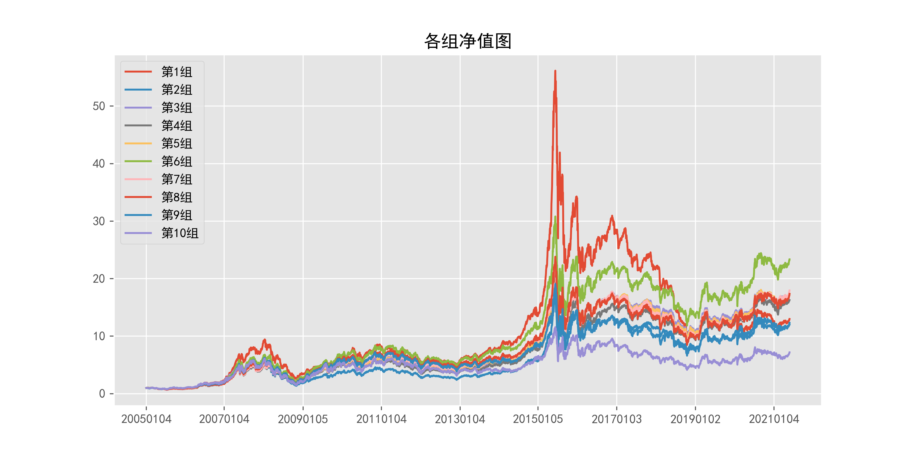

# beta_daily_000001.SH_120

## 1_基本情况

### 1.1_概率密度图

### 1.2_描述性统计

|因子换手率|样本数|均值|众数|标准差|偏度|峰度|
|:-:|:-:|:-:|:-:|:-:|:-:|:-:|
|0.19%|9260488|1.1063|0.0000|42.17%|-0.00|1.10|

|最小值|P05|P25|中位数|P75|P95|最大值|
|:-:|:-:|:-:|:-:|:-:|:-:|:-:|
|-2.6389|0.3694|0.8624|1.1228|1.3615|1.7599|4.1774|

## 2_ICIR法检验结果

### 2.1_IC时序图

### 2.2_ICIR法检验数据

|IC均值|IR值|显著比例|正显著比例|负显著比例|同向显著比例|反转显著比例|
|:-:|:-:|:-:|:-:|:-:|:-:|:-:|
|0.34%|2.66%|69.09%|34.95%|34.14%|37.28%|62.72%|

## 3_分组法检验结果

### 3.1_各组年化超额收益率图

### 3.2_各组净值图

### 3.3_Top-Bottom组合净值图

### 3.4_Top-Bottom组合月收益率图

### 3.5_Top-Bottom组合回撤图

### 3.6_分组法检验数据

|组别|组合年化|超额年化|夏普比率|信息比率|最大回撤|仓位换手率|
|:-:|:-:|:-:|:-:|:-:|:-:|:-:|
|TMB|-0.79%|-13.52%|-0.04|-0.31|72.36%|0.00%|
|1|17.44%|4.72%|0.53|0.40|82.36%|4.64%|
|2|16.87%|4.15%|0.51|0.48|73.92%|9.33%|
|3|19.60%|6.87%|0.57|0.83|70.56%|13.39%|
|4|19.12%|6.39%|0.55|0.80|69.31%|16.17%|
|5|19.59%|6.86%|0.55|0.86|71.15%|17.79%|
|6|21.85%|9.12%|0.60|1.09|70.79%|18.31%|
|7|19.85%|7.13%|0.53|0.85|70.24%|17.67%|
|8|19.60%|6.87%|0.52|0.78|70.57%|15.68%|
|9|17.06%|4.33%|0.44|0.44|73.68%|11.99%|
|10|13.17%|0.44%|0.32|0.03|75.77%|5.40%|

|组别|日均收益率|日胜率|日盈亏比|月均收益率|月胜率|月盈亏比|
|:-:|:-:|:-:|:-:|:-:|:-:|:-:|
|TMB|0.00%|49.97%|1.01|0.16%|48.73%|1.13|
|1|0.09%|56.45%|0.87|1.97%|56.35%|1.24|
|2|0.08%|56.82%|0.86|1.76%|57.87%|1.18|
|3|0.10%|56.27%|0.89|1.95%|56.85%|1.29|
|4|0.09%|56.60%|0.87|1.93%|57.36%|1.24|
|5|0.10%|56.65%|0.87|1.98%|56.85%|1.27|
|6|0.11%|56.70%|0.87|2.17%|56.85%|1.32|
|7|0.10%|56.65%|0.87|2.02%|57.36%|1.25|
|8|0.10%|56.15%|0.88|2.01%|54.82%|1.37|
|9|0.09%|55.87%|0.88|1.84%|55.84%|1.25|
|10|0.08%|54.49%|0.91|1.61%|55.33%|1.19|
