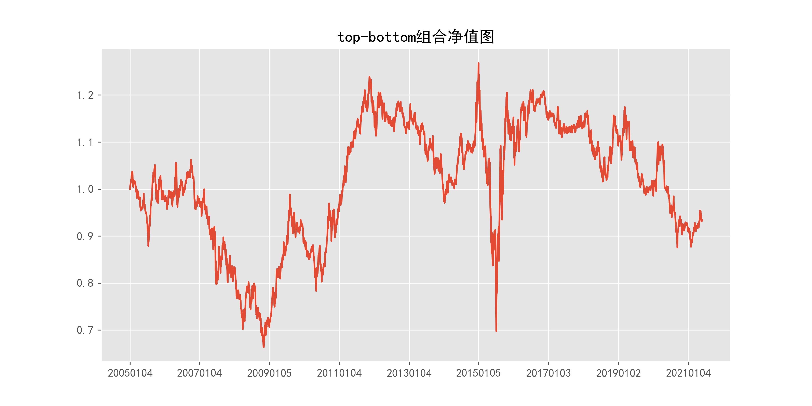

# beta_daily_120_MVFloat

## 1_基本情况

### 1.1_概率密度图

### 1.2_描述性统计

|因子换手率|样本数|均值|众数|标准差|偏度|峰度|
|:-:|:-:|:-:|:-:|:-:|:-:|:-:|
|3.23%|9260488|0.0540|0.0000|23.39%|-0.13|8.82|

|最小值|P05|P25|中位数|P75|P95|最大值|
|:-:|:-:|:-:|:-:|:-:|:-:|:-:|
|-7.8843|-0.3088|-0.0860|0.0462|0.1905|0.4410|3.5034|

## 2_ICIR法检验结果

### 2.1_IC时序图

### 2.2_ICIR法检验数据

|IC均值|IR值|显著比例|正显著比例|负显著比例|同向显著比例|反转显著比例|
|:-:|:-:|:-:|:-:|:-:|:-:|:-:|
|-0.41%|-4.71%|54.69%|25.64%|29.05%|32.56%|67.44%|

## 3_分组法检验结果

### 3.1_各组年化超额收益率图

### 3.2_各组净值图

### 3.3_Top-Bottom组合净值图

### 3.4_Top-Bottom组合月收益率图

### 3.5_Top-Bottom组合回撤图

### 3.6_分组法检验数据

|组别|组合年化|超额年化|夏普比率|信息比率|最大回撤|仓位换手率|
|:-:|:-:|:-:|:-:|:-:|:-:|:-:|
|TMB|-0.43%|-13.16%|-0.03|-0.44|44.99%|0.00%|
|1|11.25%|-1.48%|0.28|-0.13|76.19%|7.35%|
|2|18.34%|5.61%|0.48|0.57|74.72%|16.40%|
|3|18.96%|6.23%|0.51|0.67|70.64%|21.41%|
|4|19.50%|6.77%|0.53|0.77|73.00%|24.40%|
|5|22.57%|9.84%|0.63|1.22|70.82%|26.02%|
|6|21.62%|8.89%|0.61|1.10|69.18%|26.30%|
|7|22.54%|9.81%|0.64|1.28|70.44%|25.19%|
|8|19.05%|6.32%|0.55|0.85|71.49%|22.43%|
|9|18.24%|5.51%|0.53|0.74|71.95%|17.22%|
|10|13.15%|0.42%|0.39|0.05|72.32%|7.52%|

|组别|日均收益率|日胜率|日盈亏比|月均收益率|月胜率|月盈亏比|
|:-:|:-:|:-:|:-:|:-:|:-:|:-:|
|TMB|0.00%|50.70%|0.98|0.05%|50.25%|1.02|
|1|0.07%|55.92%|0.86|1.49%|55.33%|1.15|
|2|0.10%|56.70%|0.86|1.97%|56.85%|1.23|
|3|0.10%|56.52%|0.87|1.96%|56.35%|1.28|
|4|0.10%|56.65%|0.87|1.99%|57.36%|1.24|
|5|0.11%|56.70%|0.88|2.17%|57.36%|1.32|
|6|0.10%|56.40%|0.89|2.12%|55.84%|1.38|
|7|0.11%|56.65%|0.88|2.17%|56.35%|1.37|
|8|0.09%|56.47%|0.87|1.93%|55.33%|1.35|
|9|0.09%|55.90%|0.89|1.88%|55.84%|1.30|
|10|0.07%|54.87%|0.91|1.50%|55.84%|1.18|
