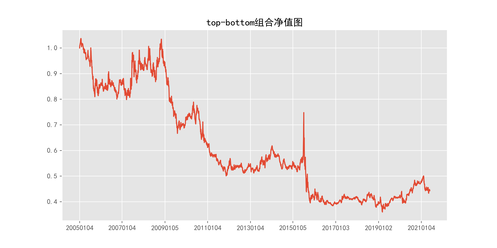

# beta_daily_120_function

## 1_基本情况

### 1.1_概率密度图

### 1.2_描述性统计

|因子换手率|样本数|均值|众数|标准差|偏度|峰度|
|:-:|:-:|:-:|:-:|:-:|:-:|:-:|
|3.35%|9260488|0.0573|0.0000|19.24%|0.01|11.88|

|最小值|P05|P25|中位数|P75|P95|最大值|
|:-:|:-:|:-:|:-:|:-:|:-:|:-:|
|-6.9069|-0.2332|-0.0634|0.0448|0.1699|0.3855|4.1736|

## 2_ICIR法检验结果

### 2.1_IC时序图

### 2.2_ICIR法检验数据

|IC均值|IR值|显著比例|正显著比例|负显著比例|同向显著比例|反转显著比例|
|:-:|:-:|:-:|:-:|:-:|:-:|:-:|
|-0.32%|-3.58%|55.04%|26.02%|29.03%|32.31%|67.69%|

## 3_分组法检验结果

### 3.1_各组年化超额收益率图

### 3.2_各组净值图

### 3.3_Top-Bottom组合净值图

### 3.4_Top-Bottom组合月收益率图

### 3.5_Top-Bottom组合回撤图

### 3.6_分组法检验数据

|组别|组合年化|超额年化|夏普比率|信息比率|最大回撤|仓位换手率|
|:-:|:-:|:-:|:-:|:-:|:-:|:-:|
|TMB|-4.98%|-17.70%|-0.36|-0.43|65.32%|0.00%|
|1|11.10%|-1.63%|0.33|-0.20|71.69%|7.40%|
|2|17.01%|4.28%|0.50|0.59|70.57%|16.75%|
|3|20.52%|7.79%|0.60|1.13|70.87%|22.24%|
|4|20.94%|8.21%|0.60|1.08|72.05%|25.19%|
|5|22.74%|10.01%|0.64|1.24|69.48%|26.20%|
|6|20.79%|8.07%|0.57|0.96|70.34%|25.86%|
|7|21.89%|9.16%|0.59|1.05|72.22%|24.25%|
|8|18.69%|5.96%|0.49|0.62|72.55%|21.29%|
|9|18.50%|5.77%|0.48|0.55|73.49%|16.27%|
|10|13.00%|0.28%|0.32|0.02|75.57%|7.27%|

|组别|日均收益率|日胜率|日盈亏比|月均收益率|月胜率|月盈亏比|
|:-:|:-:|:-:|:-:|:-:|:-:|:-:|
|TMB|-0.02%|48.29%|1.01|-0.34%|46.19%|0.92|
|1|0.06%|54.99%|0.89|1.34%|54.82%|1.18|
|2|0.09%|55.67%|0.89|1.77%|55.33%|1.31|
|3|0.10%|56.67%|0.87|2.02%|57.36%|1.28|
|4|0.10%|56.12%|0.89|2.07%|55.33%|1.39|
|5|0.11%|56.55%|0.88|2.20%|54.82%|1.47|
|6|0.10%|56.87%|0.86|2.07%|56.35%|1.33|
|7|0.11%|56.50%|0.88|2.16%|54.82%|1.43|
|8|0.10%|56.37%|0.87|1.97%|56.35%|1.27|
|9|0.10%|56.57%|0.86|1.97%|57.87%|1.18|
|10|0.08%|56.32%|0.85|1.62%|55.33%|1.18|
