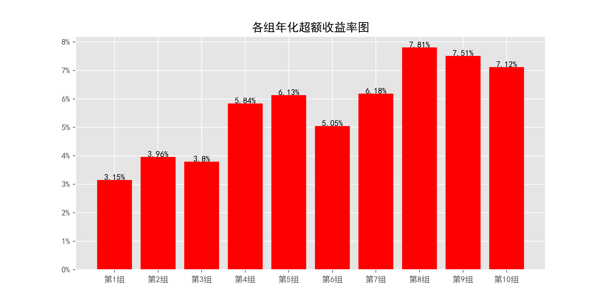

# beta_daily_index_120

## 1_基本情况

### 1.1_概率密度图

### 1.2_描述性统计

|因子换手率|样本数|均值|众数|标准差|偏度|峰度|
|:-:|:-:|:-:|:-:|:-:|:-:|:-:|
|0.16%|9260488|0.9861|0.0000|33.55%|-0.24|1.02|

|最小值|P05|P25|中位数|P75|P95|最大值|
|:-:|:-:|:-:|:-:|:-:|:-:|:-:|
|-3.3535|0.3970|0.7940|1.0051|1.1934|1.5009|2.9699|

## 2_ICIR法检验结果

### 2.1_IC时序图

### 2.2_ICIR法检验数据

|IC均值|IR值|显著比例|正显著比例|负显著比例|同向显著比例|反转显著比例|
|:-:|:-:|:-:|:-:|:-:|:-:|:-:|
|0.64%|4.49%|72.48%|37.71%|34.77%|39.61%|60.39%|

## 3_分组法检验结果

### 3.1_各组年化超额收益率图

### 3.2_各组净值图

### 3.3_Top-Bottom组合净值图

### 3.4_Top-Bottom组合月收益率图

### 3.5_Top-Bottom组合回撤图

### 3.6_分组法检验数据

|组别|组合年化|超额年化|夏普比率|信息比率|最大回撤|仓位换手率|
|:-:|:-:|:-:|:-:|:-:|:-:|:-:|
|TMB|-9.13%|-21.86%|-0.50|-0.46|83.45%|0.00%|
|1|15.88%|3.15%|0.51|0.29|79.63%|4.22%|
|2|16.69%|3.96%|0.53|0.48|71.34%|8.31%|
|3|16.52%|3.80%|0.50|0.50|74.58%|11.90%|
|4|18.57%|5.84%|0.54|0.77|71.17%|14.54%|
|5|18.86%|6.13%|0.53|0.79|72.38%|16.11%|
|6|17.78%|5.05%|0.48|0.61|71.78%|16.86%|
|7|18.91%|6.18%|0.50|0.70|71.15%|16.66%|
|8|20.53%|7.81%|0.53|0.81|70.82%|15.15%|
|9|20.24%|7.51%|0.50|0.67|71.24%|11.99%|
|10|19.85%|7.12%|0.46|0.50|71.84%|5.55%|

|组别|日均收益率|日胜率|日盈亏比|月均收益率|月胜率|月盈亏比|
|:-:|:-:|:-:|:-:|:-:|:-:|:-:|
|TMB|-0.03%|47.87%|1.01|-0.60%|45.69%|0.91|
|1|0.08%|55.77%|0.89|1.79%|56.35%|1.23|
|2|0.08%|56.25%|0.88|1.70%|56.85%|1.24|
|3|0.08%|56.27%|0.87|1.70%|58.38%|1.15|
|4|0.09%|56.50%|0.87|1.87%|56.85%|1.26|
|5|0.09%|56.65%|0.87|1.93%|57.87%|1.21|
|6|0.09%|56.80%|0.85|1.88%|56.85%|1.23|
|7|0.10%|56.32%|0.87|1.97%|57.36%|1.22|
|8|0.11%|56.22%|0.88|2.11%|56.35%|1.30|
|9|0.11%|56.02%|0.89|2.11%|56.35%|1.29|
|10|0.11%|55.67%|0.89|2.16%|53.81%|1.39|
