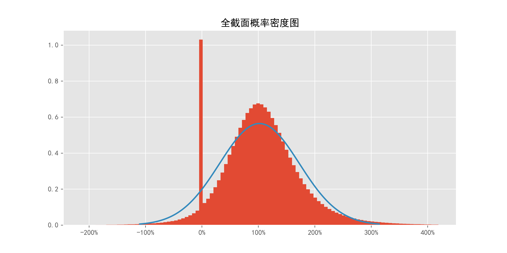
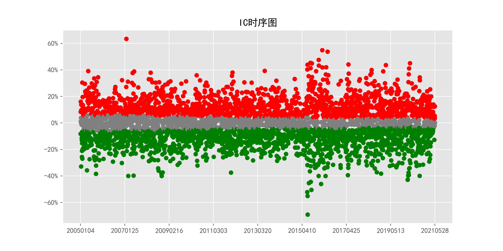
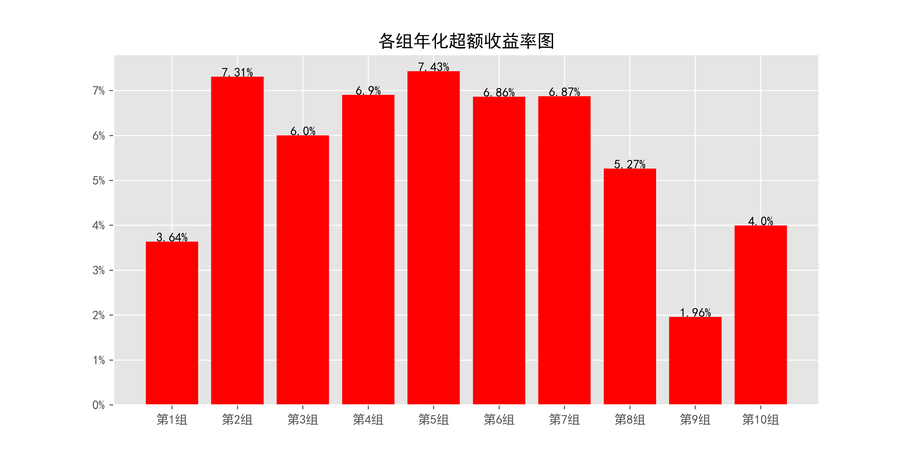
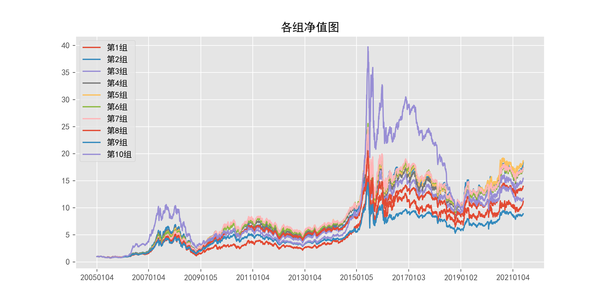
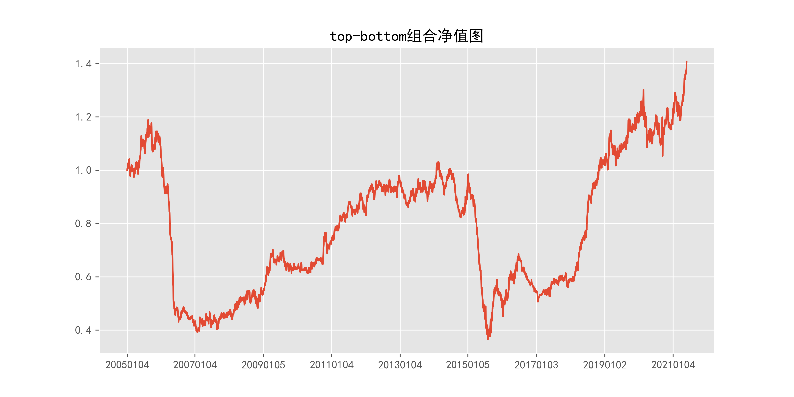
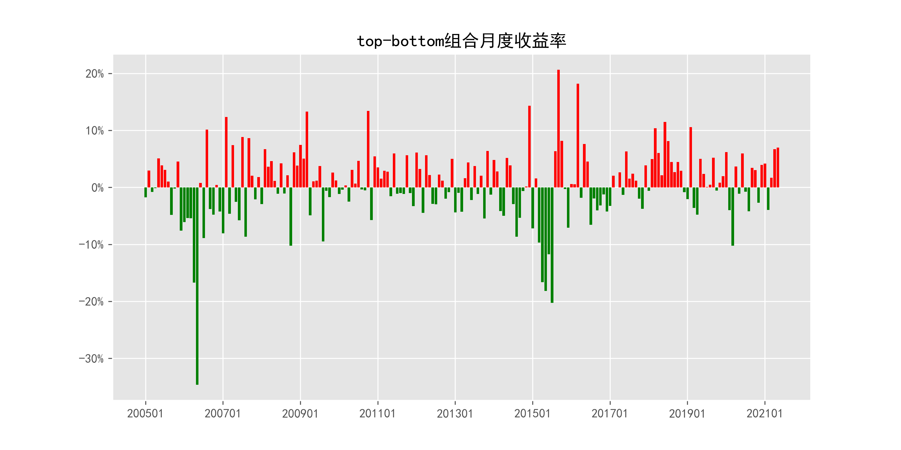
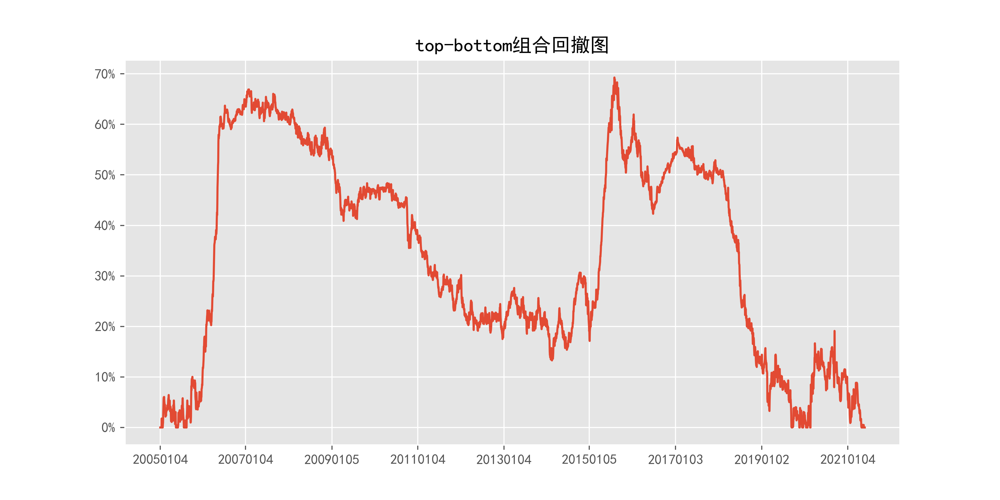

# beta_quotely

## 1_基本情况

### 1.1_概率密度图

### 1.2_描述性统计

|因子换手率|样本数|均值|众数|标准差|偏度|峰度|
|:-:|:-:|:-:|:-:|:-:|:-:|:-:|
|23.37%|9823854|1.0259|0.0000|79.13%|8.17|3053.65|

|最小值|P05|P25|中位数|P75|P95|最大值|
|:-:|:-:|:-:|:-:|:-:|:-:|:-:|
|-214.2040|0.0000|0.5864|1.0032|1.4193|2.2417|251.5195|

## 2_ICIR法检验结果

### 2.1_IC时序图

### 2.2_ICIR法检验数据

|IC均值|IR值|显著比例|正显著比例|负显著比例|同向显著比例|反转显著比例|
|:-:|:-:|:-:|:-:|:-:|:-:|:-:|
|-0.39%|-2.84%|74.46%|35.25%|39.21%|34.40%|65.60%|

## 3_分组法检验结果

### 3.1_各组年化超额收益率图

### 3.2_各组净值图

### 3.3_Top-Bottom组合净值图

### 3.4_Top-Bottom组合月收益率图

### 3.5_Top-Bottom组合回撤图

### 3.6_分组法检验数据

|组别|组合年化|超额年化|夏普比率|信息比率|最大回撤|仓位换手率|
|:-:|:-:|:-:|:-:|:-:|:-:|:-:|
|TMB|2.17%|-10.56%|0.11|-0.40|69.27%|0.00%|
|1|16.37%|3.64%|0.38|0.25|76.07%|71.97%|
|2|20.04%|7.31%|0.50|0.68|74.50%|83.92%|
|3|18.73%|6.00%|0.48|0.65|74.17%|86.76%|
|4|19.63%|6.90%|0.52|0.80|71.24%|87.89%|
|5|20.16%|7.43%|0.55|0.92|71.41%|88.19%|
|6|19.59%|6.86%|0.55|0.86|70.60%|88.06%|
|7|19.60%|6.87%|0.56|0.80|68.41%|87.44%|
|8|17.99%|5.27%|0.53|0.62|68.91%|86.20%|
|9|14.69%|1.96%|0.45|0.21|67.62%|83.31%|
|10|16.73%|4.00%|0.54|0.35|75.87%|73.63%|

|组别|日均收益率|日胜率|日盈亏比|月均收益率|月胜率|月盈亏比|
|:-:|:-:|:-:|:-:|:-:|:-:|:-:|
|TMB|0.02%|50.98%|1.00|0.38%|53.81%|1.02|
|1|0.10%|55.39%|0.89|1.87%|56.35%|1.21|
|2|0.11%|55.75%|0.89|2.10%|56.35%|1.28|
|3|0.10%|56.00%|0.88|1.97%|56.35%|1.26|
|4|0.10%|56.22%|0.88|2.01%|56.35%|1.28|
|5|0.10%|56.65%|0.87|2.05%|57.36%|1.25|
|6|0.10%|56.50%|0.87|1.98%|56.35%|1.29|
|7|0.10%|57.20%|0.85|1.95%|57.36%|1.26|
|8|0.09%|56.87%|0.86|1.82%|56.85%|1.26|
|9|0.08%|56.02%|0.88|1.56%|56.35%|1.21|
|10|0.08%|55.34%|0.91|1.92%|53.30%|1.41|
