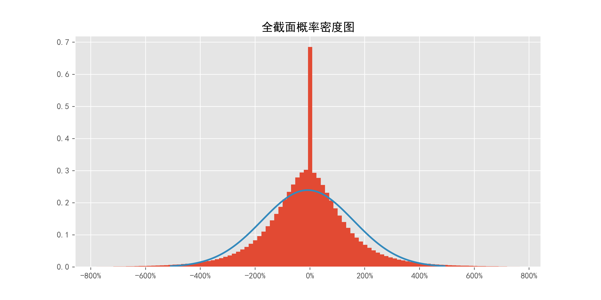
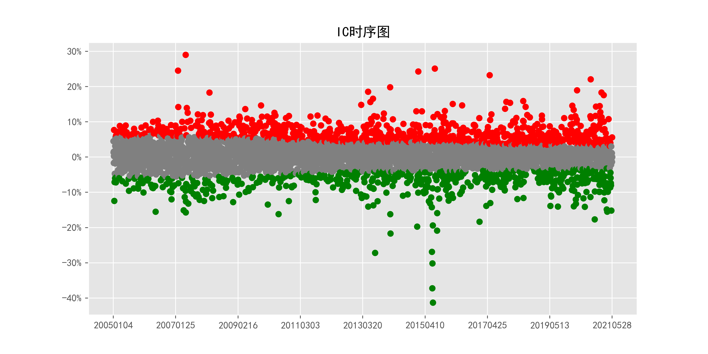
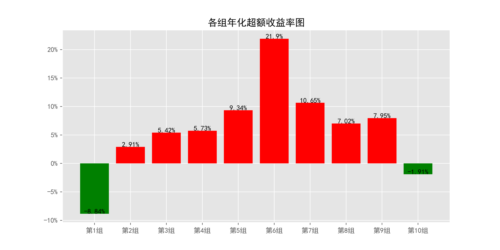
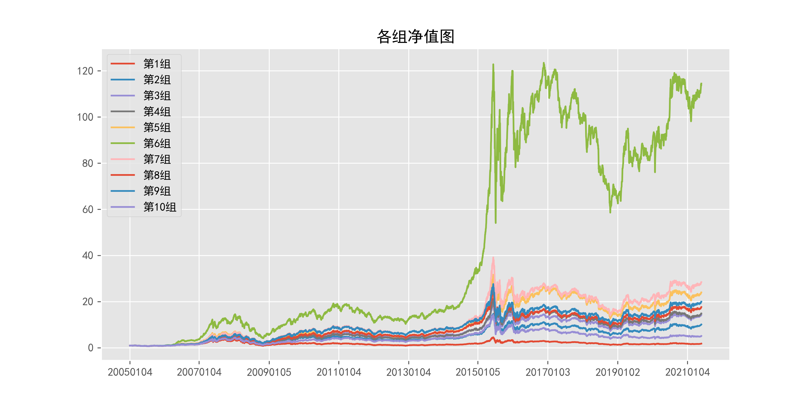
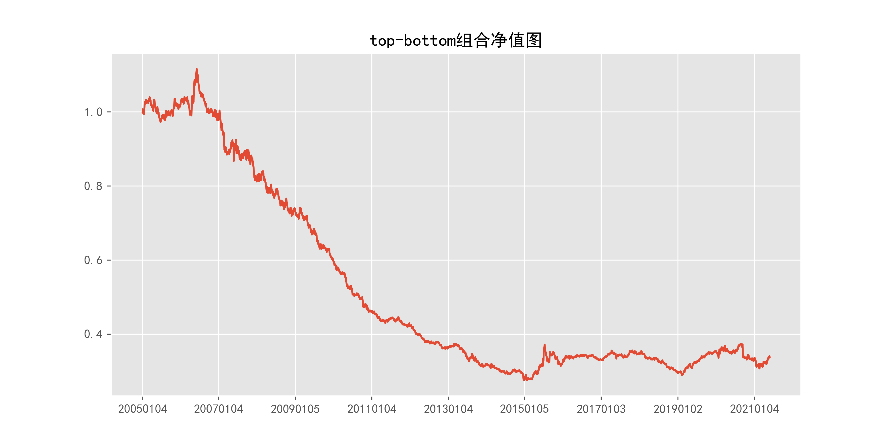
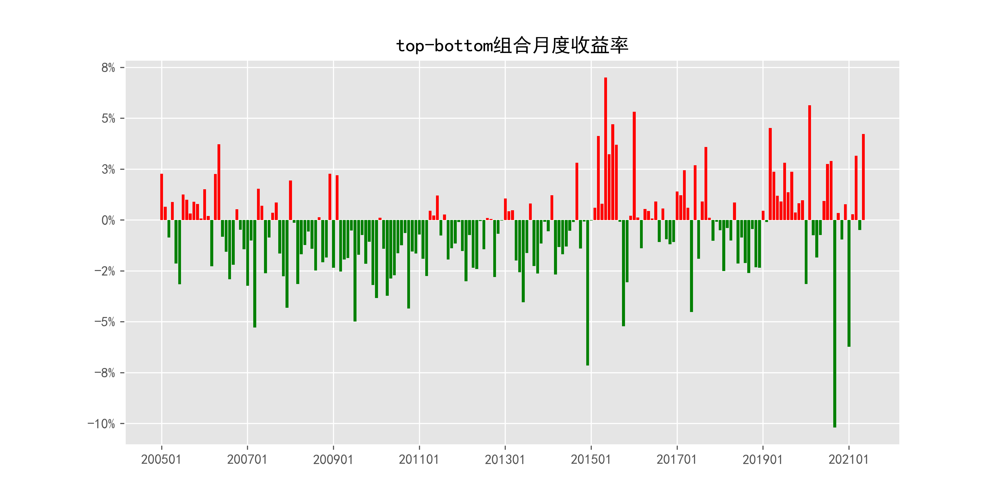
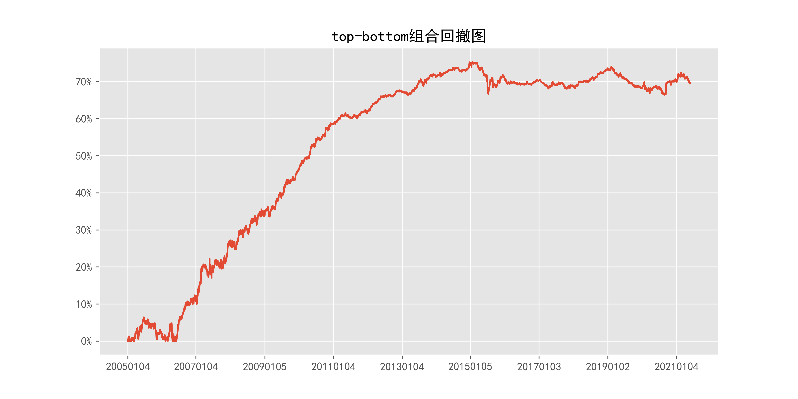

# beta_relative_quotely_5min

## 1_基本情况

### 1.1_概率密度图

### 1.2_描述性统计

|因子换手率|样本数|均值|众数|标准差|偏度|峰度|
|:-:|:-:|:-:|:-:|:-:|:-:|:-:|
|99.23%|9821045|-0.0700|0.0000|193.21%|1.83|935.53|

|最小值|P05|P25|中位数|P75|P95|最大值|
|:-:|:-:|:-:|:-:|:-:|:-:|:-:|
|-428.2250|-2.8401|-0.9138|0.0000|0.7359|2.6950|433.2208|

## 2_ICIR法检验结果

### 2.1_IC时序图

### 2.2_ICIR法检验数据

|IC均值|IR值|显著比例|正显著比例|负显著比例|同向显著比例|反转显著比例|
|:-:|:-:|:-:|:-:|:-:|:-:|:-:|
|0.52%|10.56%|32.89%|19.17%|13.72%|16.56%|83.44%|

## 3_分组法检验结果

### 3.1_各组年化超额收益率图

### 3.2_各组净值图

### 3.3_Top-Bottom组合净值图

### 3.4_Top-Bottom组合月收益率图

### 3.5_Top-Bottom组合回撤图

### 3.6_分组法检验数据

|组别|组合年化|超额年化|夏普比率|信息比率|最大回撤|仓位换手率|
|:-:|:-:|:-:|:-:|:-:|:-:|:-:|
|TMB|-6.58%|-19.31%|-0.77|-0.57|75.36%|0.00%|
|1|3.89%|-8.84%|0.10|-0.91|75.67%|86.19%|
|2|15.63%|2.91%|0.43|0.36|72.98%|89.75%|
|3|18.14%|5.42%|0.50|0.70|70.58%|89.77%|
|4|18.46%|5.73%|0.52|0.73|72.49%|89.55%|
|5|22.07%|9.34%|0.62|1.10|73.35%|89.33%|
|6|34.63%|21.90%|0.97|2.42|71.36%|88.86%|
|7|23.38%|10.65%|0.65|1.26|70.86%|89.48%|
|8|19.74%|7.02%|0.55|0.92|70.30%|89.70%|
|9|20.68%|7.95%|0.57|1.00|67.67%|89.88%|
|10|10.82%|-1.91%|0.29|-0.20|72.81%|87.04%|

|组别|日均收益率|日胜率|日盈亏比|月均收益率|月胜率|月盈亏比|
|:-:|:-:|:-:|:-:|:-:|:-:|:-:|
|TMB|-0.03%|46.24%|1.01|-0.52%|40.10%|0.81|
|1|0.04%|55.04%|0.86|0.86%|53.81%|1.06|
|2|0.09%|56.07%|0.87|1.69%|55.84%|1.23|
|3|0.09%|56.50%|0.87|1.87%|56.85%|1.24|
|4|0.09%|56.22%|0.88|1.90%|55.84%|1.30|
|5|0.11%|56.62%|0.88|2.18%|58.38%|1.24|
|6|0.14%|57.88%|0.88|3.10%|56.85%|1.59|
|7|0.11%|56.07%|0.90|2.27%|56.35%|1.39|
|8|0.10%|56.50%|0.87|1.98%|55.84%|1.34|
|9|0.10%|56.40%|0.88|2.04%|56.35%|1.33|
|10|0.07%|55.90%|0.86|1.35%|55.33%|1.16|
