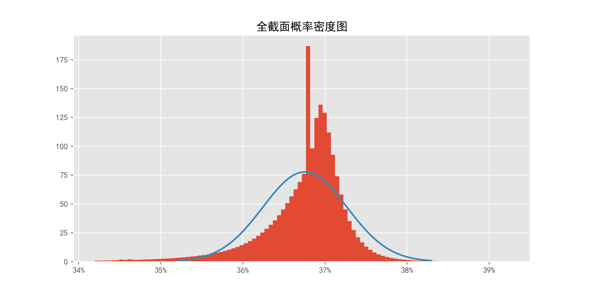
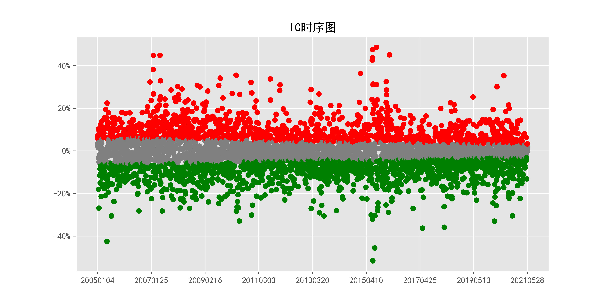
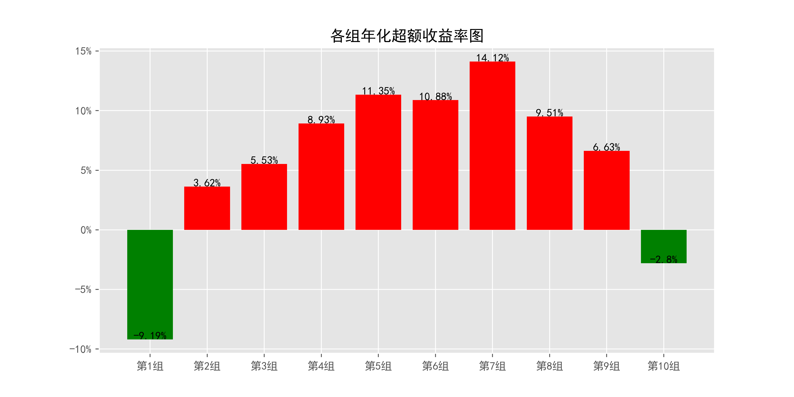
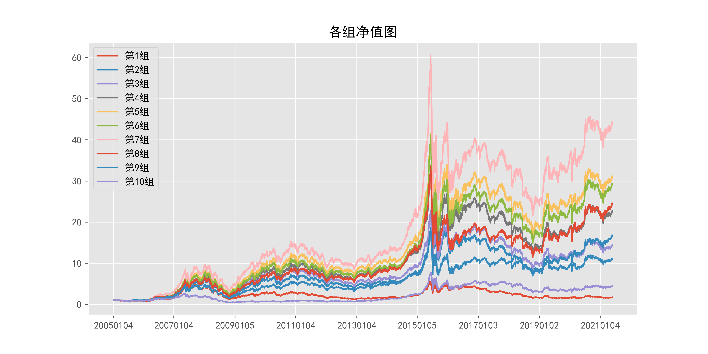
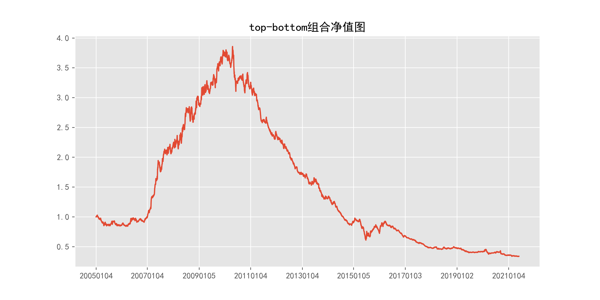
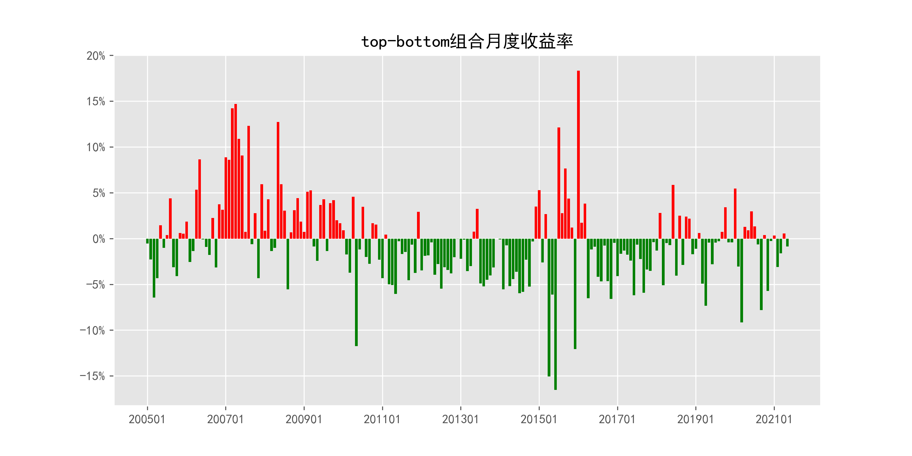
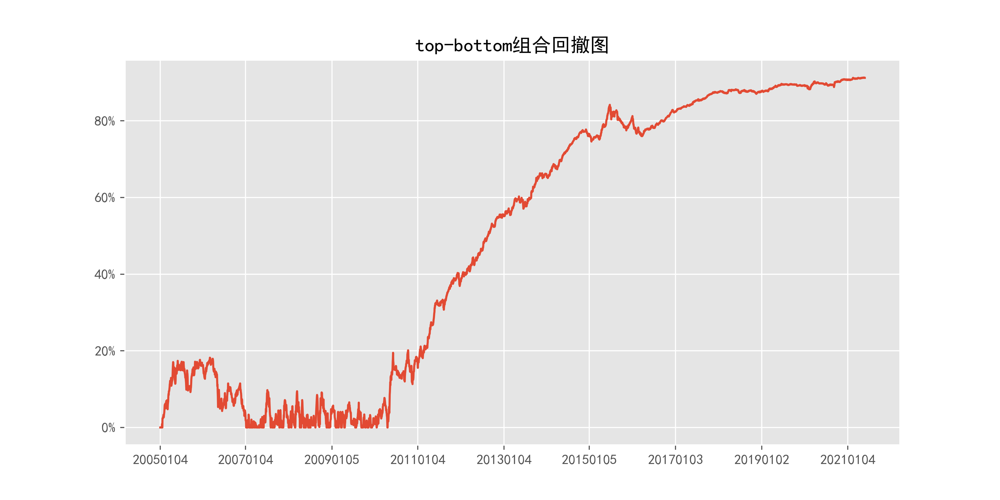

# AskBidSpread_daily_2day

## 1_基本情况

### 1.1_概率密度图

### 1.2_描述性统计

|因子换手率|样本数|均值|众数|标准差|偏度|峰度|
|:-:|:-:|:-:|:-:|:-:|:-:|:-:|
|24.52%|9781357|0.3672|0.3679|0.63%|-3.06|32.64|

|最小值|P05|P25|中位数|P75|P95|最大值|
|:-:|:-:|:-:|:-:|:-:|:-:|:-:|
|0.0066|0.3564|0.3656|0.3684|0.3704|0.3738|0.4215|

## 2_ICIR法检验结果

### 2.1_IC时序图

### 2.2_ICIR法检验数据

|IC均值|IR值|显著比例|正显著比例|负显著比例|同向显著比例|反转显著比例|
|:-:|:-:|:-:|:-:|:-:|:-:|:-:|
|nan%|nan%|59.51%|25.66%|33.84%|32.59%|67.41%|

## 3_分组法检验结果

### 3.1_各组年化超额收益率图

### 3.2_各组净值图

### 3.3_Top-Bottom组合净值图

### 3.4_Top-Bottom组合月收益率图

### 3.5_Top-Bottom组合回撤图

### 3.6_分组法检验数据

|组别|组合年化|超额年化|夏普比率|信息比率|最大回撤|仓位换手率|
|:-:|:-:|:-:|:-:|:-:|:-:|:-:|
|TMB|-6.55%|-19.28%|-0.46|-0.55|91.30%|0.00%|
|1|3.53%|-9.19%|0.09|-0.82|76.60%|82.45%|
|2|16.35%|3.62%|0.45|0.42|71.45%|88.82%|
|3|18.26%|5.53%|0.51|0.68|70.76%|89.52%|
|4|21.66%|8.93%|0.61|1.10|68.72%|89.04%|
|5|24.07%|11.35%|0.68|1.42|70.20%|88.12%|
|6|23.61%|10.88%|0.67|1.32|70.57%|87.80%|
|7|26.85%|14.12%|0.76|1.65|66.87%|88.46%|
|8|22.24%|9.51%|0.61|1.01|70.36%|89.95%|
|9|19.36%|6.63%|0.52|0.65|71.05%|90.58%|
|10|9.93%|-2.80%|0.26|-0.22|84.71%|84.02%|

|组别|日均收益率|日胜率|日盈亏比|月均收益率|月胜率|月盈亏比|
|:-:|:-:|:-:|:-:|:-:|:-:|:-:|
|TMB|-0.02%|46.69%|1.06|-0.43%|38.58%|1.24|
|1|0.04%|54.74%|0.87|0.90%|50.25%|1.23|
|2|0.09%|56.22%|0.87|1.77%|53.81%|1.35|
|3|0.09%|56.25%|0.88|1.89%|53.30%|1.43|
|4|0.10%|56.67%|0.88|2.13%|53.81%|1.50|
|5|0.11%|57.18%|0.87|2.29%|56.85%|1.37|
|6|0.11%|56.67%|0.88|2.28%|58.38%|1.28|
|7|0.12%|57.18%|0.88|2.51%|58.88%|1.31|
|8|0.11%|57.02%|0.86|2.19%|57.87%|1.27|
|9|0.10%|56.37%|0.88|1.96%|60.41%|1.11|
|10|0.07%|55.37%|0.87|1.33%|55.84%|1.12|
