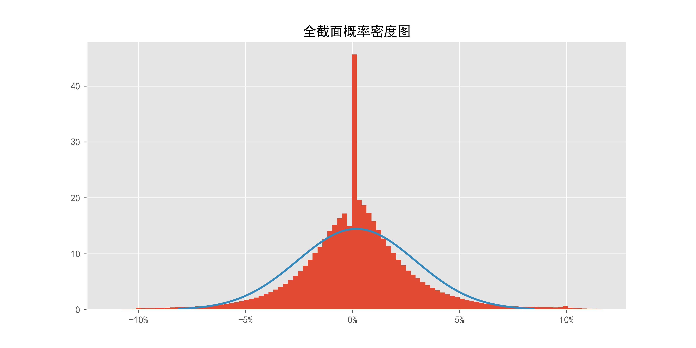
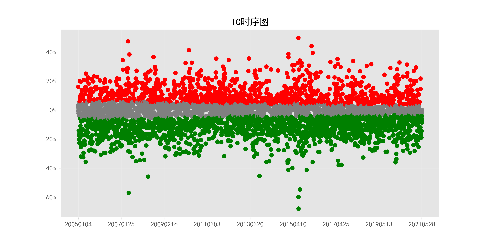
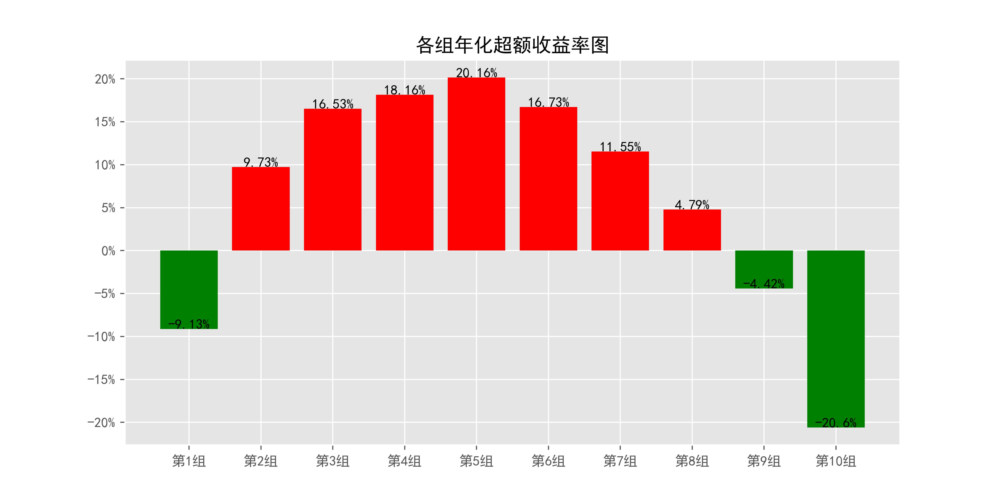
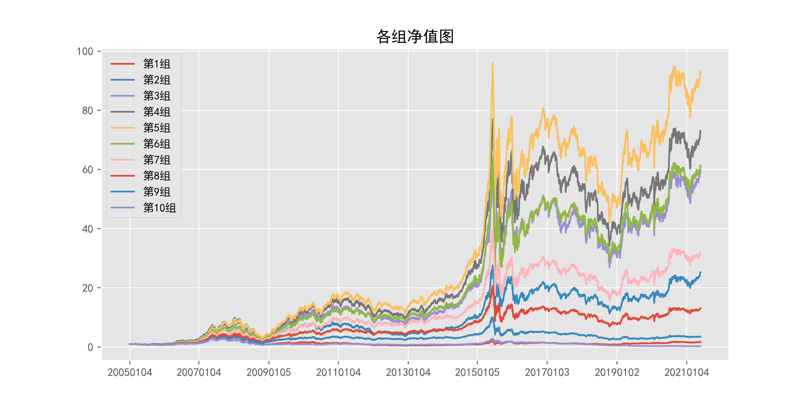
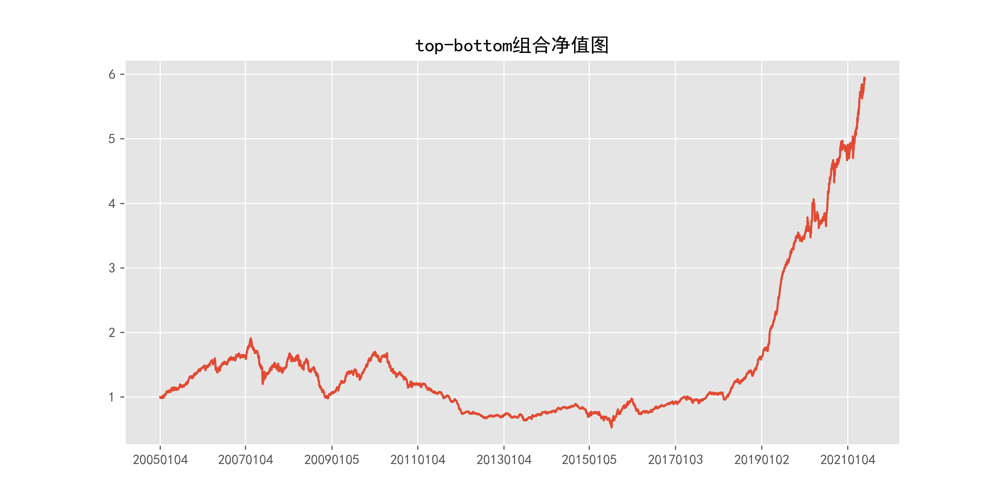
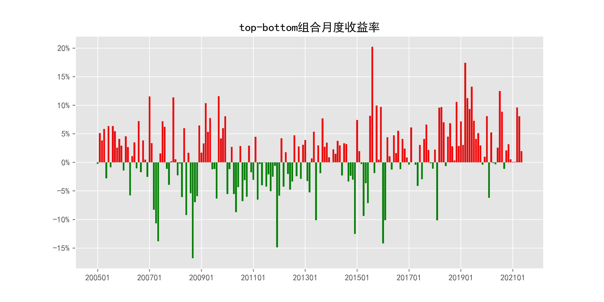
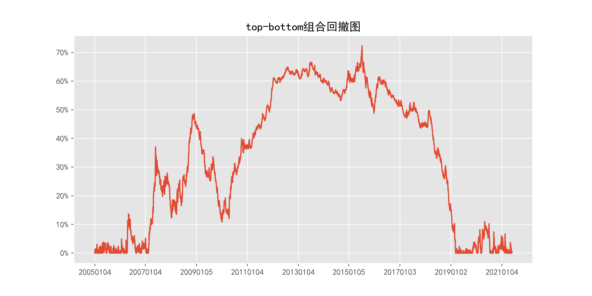

# MaxDuringReturn_daily_1day

## 1_基本情况

### 1.1_概率密度图

### 1.2_描述性统计

|因子换手率|样本数|均值|众数|标准差|偏度|峰度|
|:-:|:-:|:-:|:-:|:-:|:-:|:-:|
|101.68%|9785887|0.0019|0.0000|2.86%|0.63|37.39|

|最小值|P05|P25|中位数|P75|P95|最大值|
|:-:|:-:|:-:|:-:|:-:|:-:|:-:|
|-0.4235|-0.0426|-0.0120|0.0000|0.0149|0.0489|3.7465|

## 2_ICIR法检验结果

### 2.1_IC时序图

### 2.2_ICIR法检验数据

|IC均值|IR值|显著比例|正显著比例|负显著比例|同向显著比例|反转显著比例|
|:-:|:-:|:-:|:-:|:-:|:-:|:-:|
|-2.51%|-20.93%|69.97%|25.54%|44.43%|37.96%|62.04%|

## 3_分组法检验结果

### 3.1_各组年化超额收益率图

### 3.2_各组净值图

### 3.3_Top-Bottom组合净值图

### 3.4_Top-Bottom组合月收益率图

### 3.5_Top-Bottom组合回撤图

### 3.6_分组法检验数据

|组别|组合年化|超额年化|夏普比率|信息比率|最大回撤|仓位换手率|
|:-:|:-:|:-:|:-:|:-:|:-:|:-:|
|TMB|11.80%|-0.93%|0.67|-0.03|72.30%|0.00%|
|1|3.60%|-9.13%|0.09|-0.76|89.95%|87.14%|
|2|22.46%|9.73%|0.60|0.96|77.22%|90.20%|
|3|29.26%|16.53%|0.80|1.77|73.32%|89.90%|
|4|30.89%|18.16%|0.84|1.97|71.04%|89.19%|
|5|32.89%|20.16%|0.91|2.22|69.03%|88.75%|
|6|29.46%|16.73%|0.82|1.99|68.35%|88.95%|
|7|24.28%|11.55%|0.68|1.39|67.34%|89.72%|
|8|17.52%|4.79%|0.49|0.54|66.58%|90.35%|
|9|8.30%|-4.42%|0.23|-0.45|76.18%|89.98%|
|10|-7.87%|-20.60%|-0.22|-1.61|91.31%|84.72%|

|组别|日均收益率|日胜率|日盈亏比|月均收益率|月胜率|月盈亏比|
|:-:|:-:|:-:|:-:|:-:|:-:|:-:|
|TMB|0.05%|54.62%|0.95|1.08%|58.38%|1.15|
|1|0.04%|54.99%|0.86|0.94%|54.31%|1.04|
|2|0.11%|56.55%|0.88|2.27%|57.36%|1.28|
|3|0.13%|57.45%|0.87|2.70%|59.39%|1.31|
|4|0.13%|57.45%|0.88|2.79%|57.87%|1.45|
|5|0.14%|57.80%|0.87|2.91%|58.38%|1.46|
|6|0.13%|57.05%|0.89|2.67%|58.38%|1.40|
|7|0.11%|56.62%|0.89|2.29%|56.85%|1.39|
|8|0.09%|56.12%|0.88|1.79%|55.33%|1.33|
|9|0.06%|54.77%|0.89|1.10%|53.81%|1.18|
|10|-0.01%|52.48%|0.90|-0.20%|44.67%|1.17|
