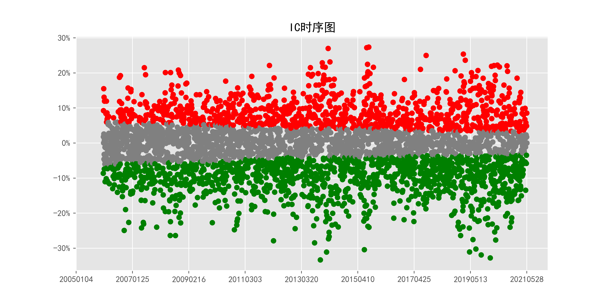
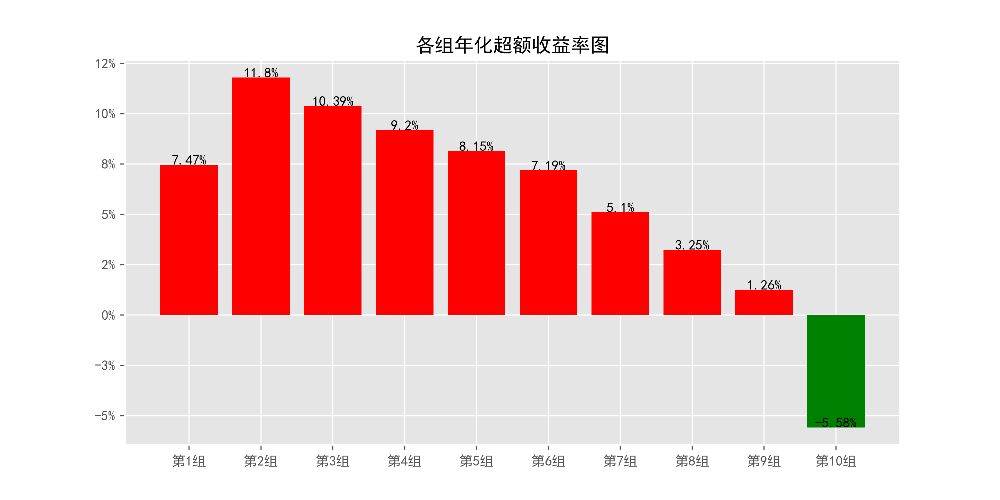
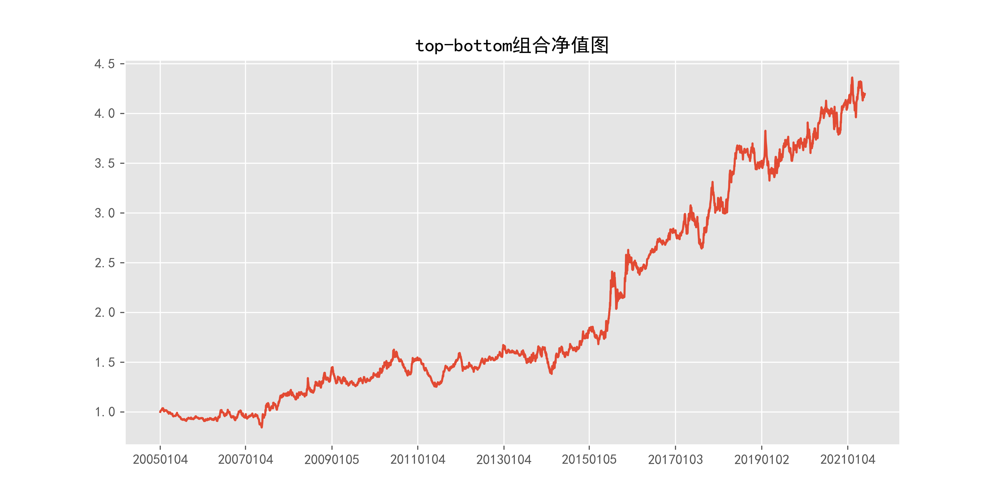

# MaxDuringReturn_daily_240days

## 1_基本情况

### 1.1_概率密度图

### 1.2_描述性统计

|因子换手率|样本数|均值|众数|标准差|偏度|峰度|
|:-:|:-:|:-:|:-:|:-:|:-:|:-:|
|0.17%|8766020|0.1025|0.1000|3.68%|27.35|2632.70|

|最小值|P05|P25|中位数|P75|P95|最大值|
|:-:|:-:|:-:|:-:|:-:|:-:|:-:|
|0.0000|0.0556|0.0850|0.1011|0.1147|0.1556|3.7465|

## 2_ICIR法检验结果

### 2.1_IC时序图

### 2.2_ICIR法检验数据

|IC均值|IR值|显著比例|正显著比例|负显著比例|同向显著比例|反转显著比例|
|:-:|:-:|:-:|:-:|:-:|:-:|:-:|
|nan%|nan%|56.27%|23.26%|33.02%|36.30%|63.70%|

## 3_分组法检验结果

### 3.1_各组年化超额收益率图

### 3.2_各组净值图

### 3.3_Top-Bottom组合净值图

### 3.4_Top-Bottom组合月收益率图

### 3.5_Top-Bottom组合回撤图

### 3.6_分组法检验数据

|组别|组合年化|超额年化|夏普比率|信息比率|最大回撤|仓位换手率|
|:-:|:-:|:-:|:-:|:-:|:-:|:-:|
|TMB|9.41%|-3.31%|0.72|-0.08|22.98%|0.00%|
|1|20.20%|7.47%|0.58|0.61|70.29%|2.91%|
|2|24.53%|11.80%|0.75|1.60|68.08%|4.06%|
|3|23.12%|10.39%|0.68|1.51|70.72%|4.00%|
|4|21.93%|9.20%|0.62|1.24|69.74%|4.25%|
|5|20.88%|8.15%|0.58|1.08|72.52%|4.29%|
|6|19.92%|7.19%|0.54|0.87|71.96%|4.22%|
|7|17.83%|5.10%|0.48|0.61|70.72%|4.04%|
|8|15.97%|3.25%|0.43|0.38|74.02%|3.76%|
|9|13.99%|1.26%|0.36|0.13|74.29%|3.30%|
|10|7.15%|-5.58%|0.18|-0.51|78.58%|2.38%|

|组别|日均收益率|日胜率|日盈亏比|月均收益率|月胜率|月盈亏比|
|:-:|:-:|:-:|:-:|:-:|:-:|:-:|
|TMB|0.04%|49.15%|1.18|0.81%|58.38%|1.25|
|1|0.10%|55.85%|0.90|2.05%|57.87%|1.22|
|2|0.11%|57.07%|0.88|2.26%|56.85%|1.44|
|3|0.11%|56.47%|0.89|2.19%|59.39%|1.25|
|4|0.10%|56.42%|0.89|2.13%|56.35%|1.37|
|5|0.10%|56.40%|0.88|2.08%|56.35%|1.33|
|6|0.10%|56.42%|0.88|2.02%|55.84%|1.33|
|7|0.09%|56.42%|0.87|1.89%|55.33%|1.30|
|8|0.09%|56.00%|0.87|1.78%|55.33%|1.26|
|9|0.08%|55.92%|0.87|1.65%|55.84%|1.18|
|10|0.06%|55.80%|0.85|1.16%|54.82%|1.09|
