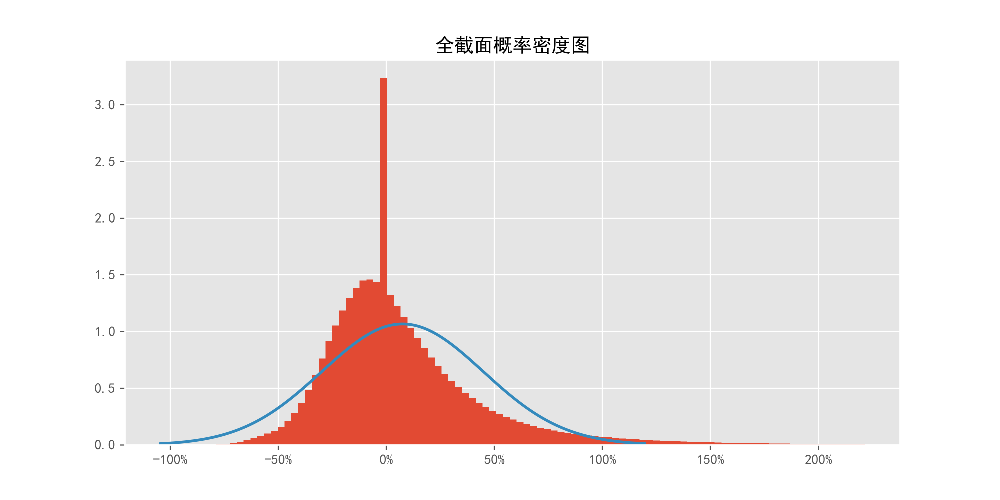
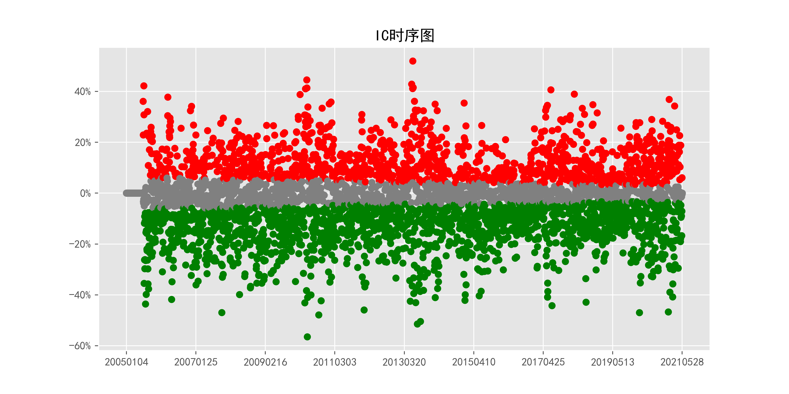
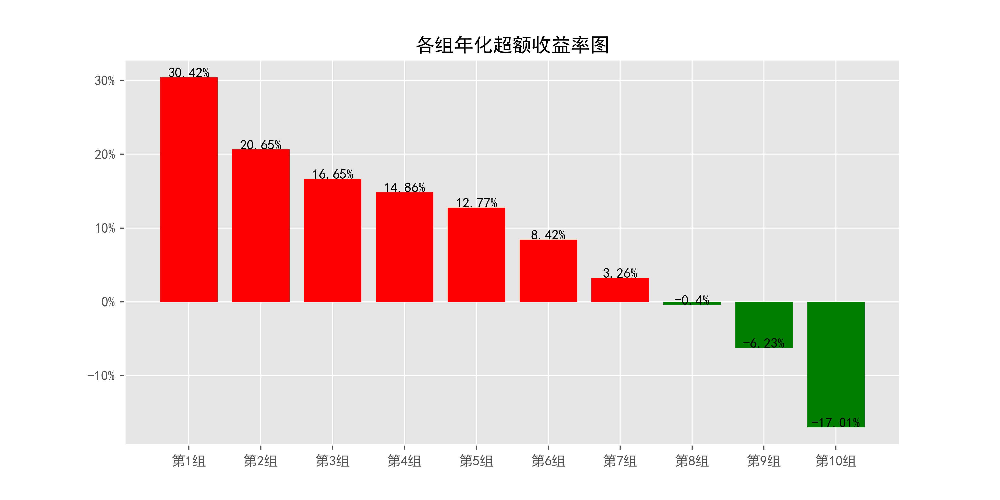
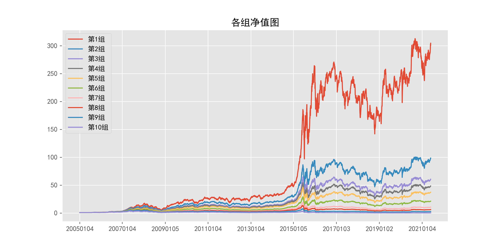
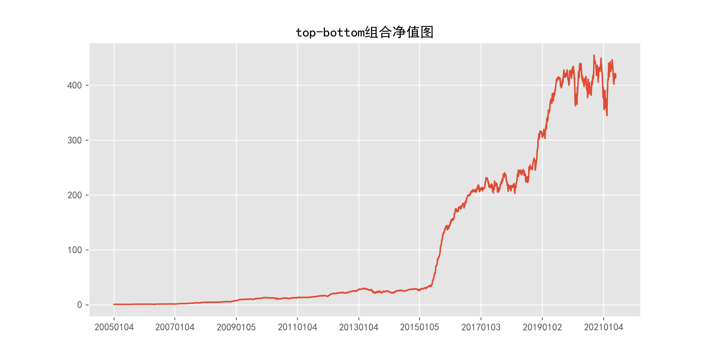
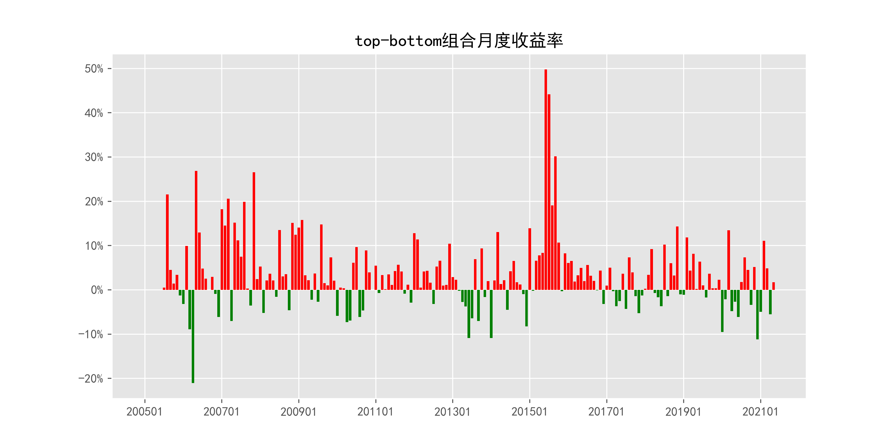
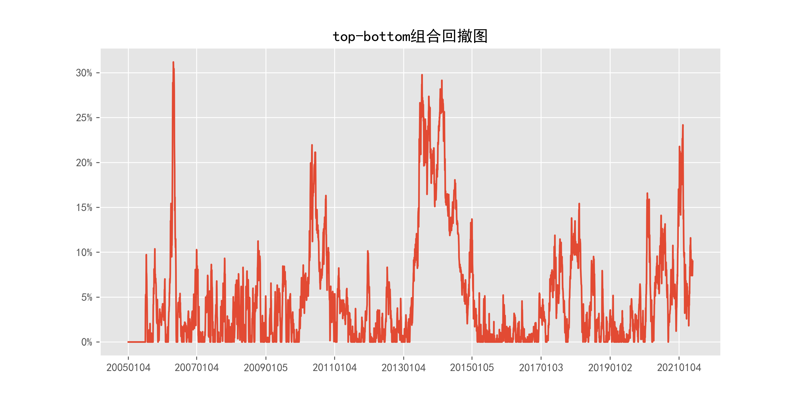

# ReturnMomentum_daily_120Days

## 1_基本情况

### 1.1_概率密度图

### 1.2_描述性统计

|因子换手率|样本数|均值|众数|标准差|偏度|峰度|
|:-:|:-:|:-:|:-:|:-:|:-:|:-:|
|3.64%|9795976|0.0880|0.0000|42.53%|3.09|22.79|

|最小值|P05|P25|中位数|P75|P95|最大值|
|:-:|:-:|:-:|:-:|:-:|:-:|:-:|
|-0.9450|-0.3704|-0.1522|0.0000|0.2148|0.8327|15.4790|

## 2_ICIR法检验结果

### 2.1_IC时序图

### 2.2_ICIR法检验数据

|IC均值|IR值|显著比例|正显著比例|负显著比例|同向显著比例|反转显著比例|
|:-:|:-:|:-:|:-:|:-:|:-:|:-:|
|-2.59%|-19.16%|70.82%|27.57%|43.25%|44.51%|55.49%|

## 3_分组法检验结果

### 3.1_各组年化超额收益率图

### 3.2_各组净值图

### 3.3_Top-Bottom组合净值图

### 3.4_Top-Bottom组合月收益率图

### 3.5_Top-Bottom组合回撤图

### 3.6_分组法检验数据

|组别|组合年化|超额年化|夏普比率|信息比率|最大回撤|仓位换手率|
|:-:|:-:|:-:|:-:|:-:|:-:|:-:|
|TMB|45.93%|33.20%|2.30|0.84|31.20%|0.00%|
|1|43.14%|30.42%|1.16|2.21|69.52%|14.72%|
|2|33.38%|20.65%|0.94|1.86|70.69%|30.75%|
|3|29.38%|16.65%|0.83|1.59|69.08%|38.59%|
|4|27.59%|14.86%|0.78|1.51|71.00%|42.42%|
|5|25.50%|12.77%|0.72|1.34|70.10%|43.57%|
|6|21.15%|8.42%|0.59|0.89|71.29%|42.61%|
|7|15.99%|3.26%|0.45|0.35|71.85%|39.56%|
|8|12.33%|-0.40%|0.34|-0.04|75.73%|34.14%|
|9|6.50%|-6.23%|0.18|-0.59|78.46%|25.52%|
|10|-4.28%|-17.01%|-0.11|-1.21|91.43%|12.41%|

|组别|日均收益率|日胜率|日盈亏比|月均收益率|月胜率|月盈亏比|
|:-:|:-:|:-:|:-:|:-:|:-:|:-:|
|TMB|0.16%|52.96%|1.19|3.42%|65.99%|1.75|
|1|0.17%|55.67%|0.92|3.63%|58.38%|1.55|
|2|0.14%|55.80%|0.89|2.92%|57.36%|1.47|
|3|0.13%|55.95%|0.87|2.64%|56.85%|1.42|
|4|0.12%|55.49%|0.88|2.51%|57.36%|1.35|
|5|0.12%|55.57%|0.87|2.36%|58.38%|1.26|
|6|0.10%|55.32%|0.86|2.06%|55.33%|1.34|
|7|0.09%|54.54%|0.87|1.71%|54.82%|1.23|
|8|0.07%|54.21%|0.87|1.46%|53.81%|1.20|
|9|0.05%|53.81%|0.86|1.02%|55.33%|1.00|
|10|0.01%|52.68%|0.85|0.23%|47.72%|1.10|
