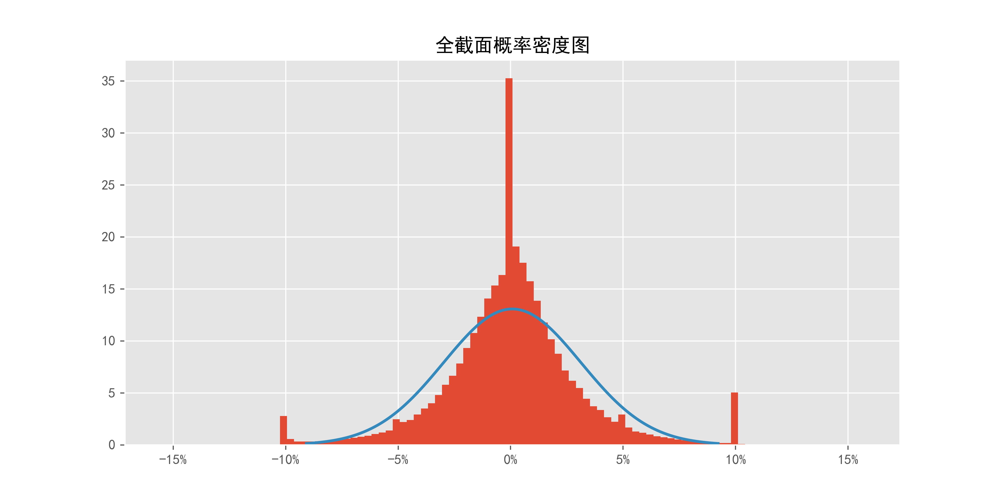
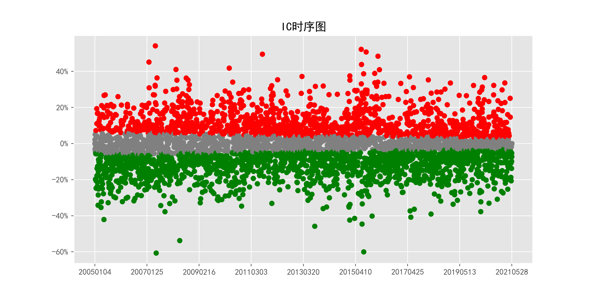
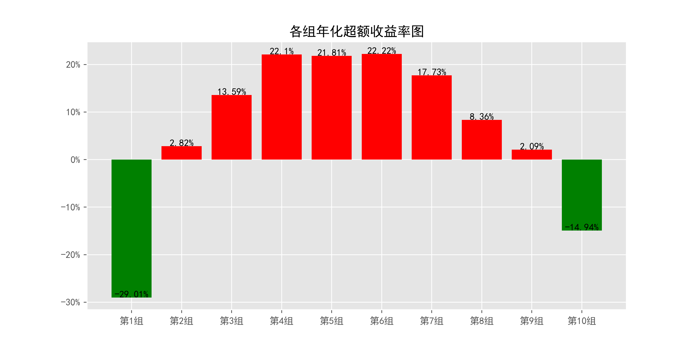
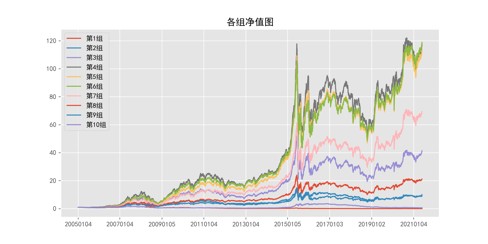
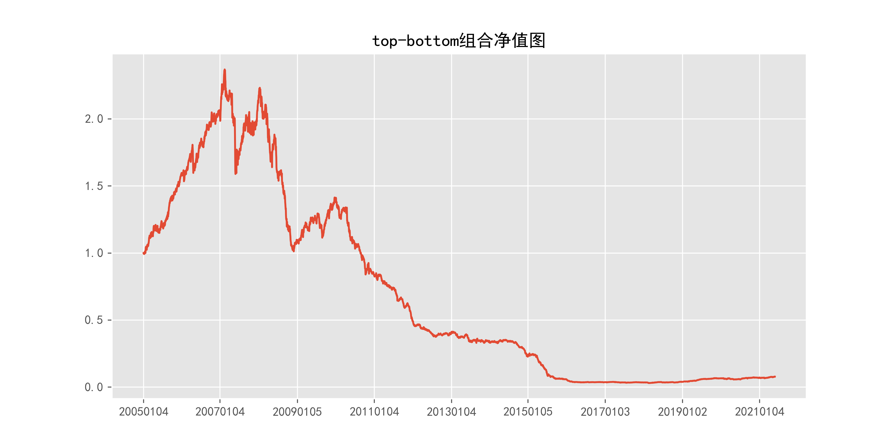
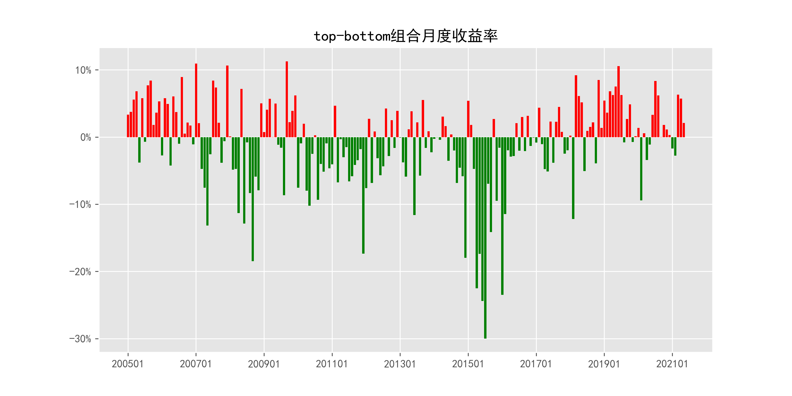
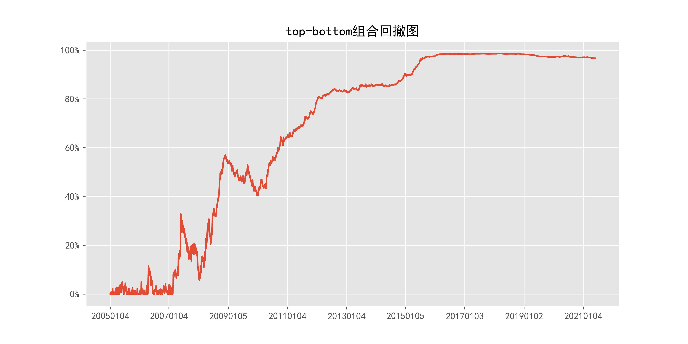

# ReturnMomentum_daily_1Days

## 1_基本情况

### 1.1_概率密度图

### 1.2_描述性统计

|因子换手率|样本数|均值|众数|标准差|偏度|峰度|
|:-:|:-:|:-:|:-:|:-:|:-:|:-:|
|100.82%|9785819|0.0008|0.0000|3.13%|8.55|2201.23|

|最小值|P05|P25|中位数|P75|P95|最大值|
|:-:|:-:|:-:|:-:|:-:|:-:|:-:|
|-0.6873|-0.0484|-0.0137|0.0000|0.0145|0.0503|10.8663|

## 2_ICIR法检验结果

### 2.1_IC时序图

### 2.2_ICIR法检验数据

|IC均值|IR值|显著比例|正显著比例|负显著比例|同向显著比例|反转显著比例|
|:-:|:-:|:-:|:-:|:-:|:-:|:-:|
|-1.75%|-13.77%|71.83%|29.13%|42.70%|37.83%|62.17%|

## 3_分组法检验结果

### 3.1_各组年化超额收益率图

### 3.2_各组净值图

### 3.3_Top-Bottom组合净值图

### 3.4_Top-Bottom组合月收益率图

### 3.5_Top-Bottom组合回撤图

### 3.6_分组法检验数据

|组别|组合年化|超额年化|夏普比率|信息比率|最大回撤|仓位换手率|
|:-:|:-:|:-:|:-:|:-:|:-:|:-:|
|TMB|-14.75%|-27.48%|-0.79|-0.80|98.70%|0.00%|
|1|-16.29%|-29.01%|-0.41|-2.23|98.87%|84.29%|
|2|15.54%|2.82%|0.41|0.26|79.38%|90.03%|
|3|26.31%|13.59%|0.71|1.38|73.52%|90.17%|
|4|34.83%|22.10%|0.95|2.38|72.04%|89.24%|
|5|34.53%|21.81%|0.95|2.35|69.48%|88.36%|
|6|34.95%|22.22%|0.97|2.54|65.26%|88.38%|
|7|30.45%|17.73%|0.86|2.07|64.24%|89.49%|
|8|21.09%|8.36%|0.60|0.99|62.95%|90.37%|
|9|14.82%|2.09%|0.42|0.22|59.26%|90.07%|
|10|-2.21%|-14.94%|-0.06|-1.11|82.24%|83.73%|

|组别|日均收益率|日胜率|日盈亏比|月均收益率|月胜率|月盈亏比|
|:-:|:-:|:-:|:-:|:-:|:-:|:-:|
|TMB|-0.06%|50.65%|0.85|-1.04%|47.72%|0.71|
|1|-0.04%|53.26%|0.84|-0.73%|50.25%|0.82|
|2|0.09%|56.22%|0.86|1.80%|56.85%|1.17|
|3|0.12%|57.23%|0.87|2.55%|58.38%|1.30|
|4|0.15%|58.05%|0.87|3.07%|58.38%|1.49|
|5|0.15%|58.13%|0.87|3.03%|58.38%|1.49|
|6|0.15%|57.63%|0.89|3.02%|57.87%|1.57|
|7|0.13%|56.75%|0.90|2.68%|58.88%|1.43|
|8|0.10%|56.12%|0.89|2.01%|58.88%|1.23|
|9|0.08%|54.84%|0.91|1.56%|55.33%|1.27|
|10|0.02%|52.86%|0.91|0.29%|46.70%|1.24|
