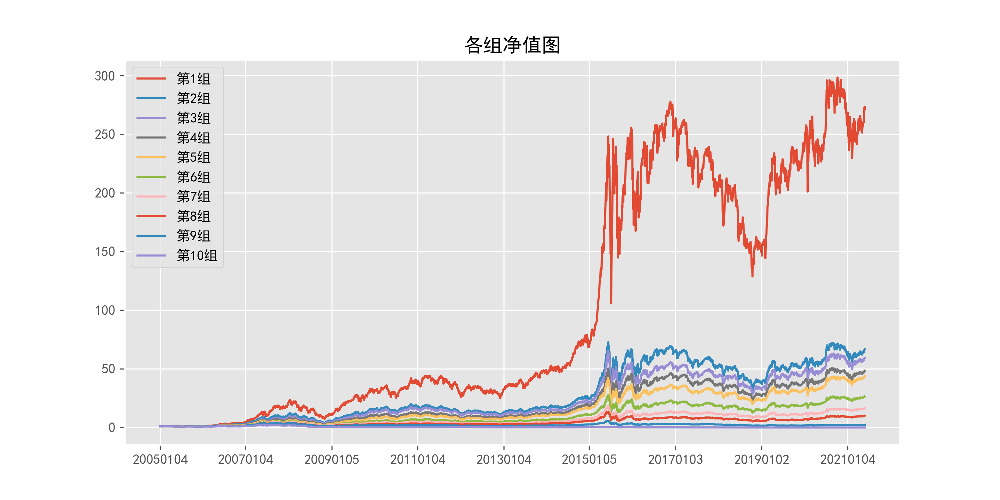

# ReturnMomentum_daily_20Days

## 1_基本情况

### 1.1_概率密度图

### 1.2_描述性统计

|因子换手率|样本数|均值|众数|标准差|偏度|峰度|
|:-:|:-:|:-:|:-:|:-:|:-:|:-:|
|11.06%|9784971|0.0154|0.0000|16.18%|4.43|105.97|

|最小值|P05|P25|中位数|P75|P95|最大值|
|:-:|:-:|:-:|:-:|:-:|:-:|:-:|
|-0.8777|-0.1971|-0.0682|0.0000|0.0811|0.2636|10.8663|

## 2_ICIR法检验结果

### 2.1_IC时序图

### 2.2_ICIR法检验数据

|IC均值|IR值|显著比例|正显著比例|负显著比例|同向显著比例|反转显著比例|
|:-:|:-:|:-:|:-:|:-:|:-:|:-:|
|-4.10%|-27.10%|77.04%|27.40%|49.65%|44.98%|55.02%|

## 3_分组法检验结果

### 3.1_各组年化超额收益率图

### 3.2_各组净值图

### 3.3_Top-Bottom组合净值图

### 3.4_Top-Bottom组合月收益率图

### 3.5_Top-Bottom组合回撤图

### 3.6_分组法检验数据

|组别|组合年化|超额年化|夏普比率|信息比率|最大回撤|仓位换手率|
|:-:|:-:|:-:|:-:|:-:|:-:|:-:|
|TMB|71.93%|59.20%|3.15|1.53|21.63%|0.00%|
|1|42.19%|29.46%|1.07|1.99|68.10%|25.41%|
|2|30.15%|17.42%|0.80|1.48|68.70%|51.89%|
|3|29.18%|16.46%|0.79|1.62|66.63%|61.06%|
|4|27.56%|14.83%|0.76|1.55|68.66%|64.71%|
|5|26.75%|14.03%|0.75|1.62|69.47%|65.95%|
|6|22.81%|10.08%|0.64|1.21|70.11%|65.39%|
|7|19.22%|6.49%|0.54|0.80|71.39%|62.81%|
|8|15.58%|2.85%|0.44|0.34|74.37%|57.58%|
|9|5.46%|-7.27%|0.15|-0.76|75.62%|46.68%|
|10|-18.95%|-31.67%|-0.50|-2.18|98.67%|21.09%|

|组别|日均收益率|日胜率|日盈亏比|月均收益率|月胜率|月盈亏比|
|:-:|:-:|:-:|:-:|:-:|:-:|:-:|
|TMB|0.23%|57.70%|1.13|4.80%|78.17%|1.86|
|1|0.17%|57.18%|0.91|3.60%|60.41%|1.47|
|2|0.13%|57.23%|0.87|2.76%|58.88%|1.34|
|3|0.13%|57.30%|0.87|2.67%|57.36%|1.42|
|4|0.12%|56.35%|0.90|2.55%|58.88%|1.30|
|5|0.12%|56.90%|0.88|2.48%|57.87%|1.36|
|6|0.11%|56.52%|0.88|2.20%|58.38%|1.25|
|7|0.10%|56.00%|0.88|1.92%|57.36%|1.24|
|8|0.08%|55.47%|0.88|1.66%|57.36%|1.17|
|9|0.05%|54.42%|0.88|0.89%|51.78%|1.19|
|10|-0.05%|52.03%|0.86|-1.10%|40.10%|1.13|
