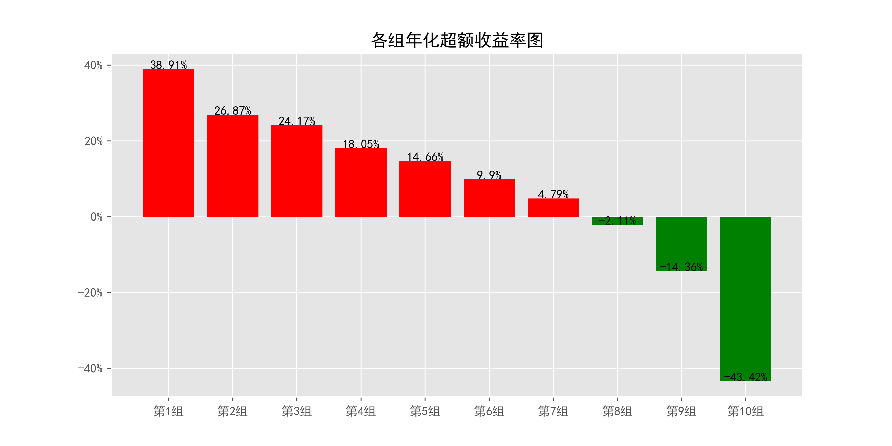

# ReturnMomentum_daily_5Days

## 1_基本情况

### 1.1_概率密度图

### 1.2_描述性统计

|因子换手率|样本数|均值|众数|标准差|偏度|峰度|
|:-:|:-:|:-:|:-:|:-:|:-:|:-:|
|30.55%|9785571|0.0041|0.0000|7.61%|3.81|315.45|

|最小值|P05|P25|中位数|P75|P95|最大值|
|:-:|:-:|:-:|:-:|:-:|:-:|:-:|
|-0.7212|-0.1061|-0.0330|0.0000|0.0368|0.1204|10.8663|

## 2_ICIR法检验结果

### 2.1_IC时序图

### 2.2_ICIR法检验数据

|IC均值|IR值|显著比例|正显著比例|负显著比例|同向显著比例|反转显著比例|
|:-:|:-:|:-:|:-:|:-:|:-:|:-:|
|-5.96%|-40.70%|78.75%|22.38%|56.37%|48.92%|51.08%|

## 3_分组法检验结果

### 3.1_各组年化超额收益率图

### 3.2_各组净值图

### 3.3_Top-Bottom组合净值图

### 3.4_Top-Bottom组合月收益率图

### 3.5_Top-Bottom组合回撤图

### 3.6_分组法检验数据

|组别|组合年化|超额年化|夏普比率|信息比率|最大回撤|仓位换手率|
|:-:|:-:|:-:|:-:|:-:|:-:|:-:|
|TMB|116.07%|103.34%|5.25|2.83|31.22%|0.00%|
|1|51.64%|38.91%|1.29|2.68|71.66%|45.53%|
|2|39.60%|26.87%|1.03|2.30|71.58%|71.48%|
|3|36.90%|24.17%|0.99|2.32|69.04%|77.40%|
|4|30.77%|18.05%|0.84|1.91|69.62%|79.75%|
|5|27.39%|14.66%|0.76|1.66|66.93%|80.53%|
|6|22.62%|9.90%|0.63|1.17|66.33%|80.23%|
|7|17.52%|4.79%|0.49|0.60|68.11%|79.10%|
|8|10.62%|-2.11%|0.30|-0.25|69.50%|75.95%|
|9|-1.63%|-14.36%|-0.05|-1.50|81.05%|68.18%|
|10|-30.69%|-43.42%|-0.84|-3.05|99.73%|38.79%|

|组别|日均收益率|日胜率|日盈亏比|月均收益率|月胜率|月盈亏比|
|:-:|:-:|:-:|:-:|:-:|:-:|:-:|
|TMB|0.32%|62.49%|1.14|6.69%|85.28%|2.71|
|1|0.20%|58.68%|0.88|4.31%|59.39%|1.63|
|2|0.16%|58.23%|0.87|3.41%|59.90%|1.45|
|3|0.15%|57.43%|0.90|3.19%|60.91%|1.37|
|4|0.13%|57.28%|0.88|2.76%|59.90%|1.33|
|5|0.12%|56.57%|0.90|2.50%|58.38%|1.36|
|6|0.11%|56.50%|0.88|2.18%|56.35%|1.38|
|7|0.09%|55.57%|0.90|1.77%|57.36%|1.23|
|8|0.07%|55.57%|0.87|1.25%|54.82%|1.19|
|9|0.02%|53.51%|0.89|0.29%|52.28%|1.00|
|10|-0.12%|50.18%|0.86|-2.41%|35.53%|0.96|
