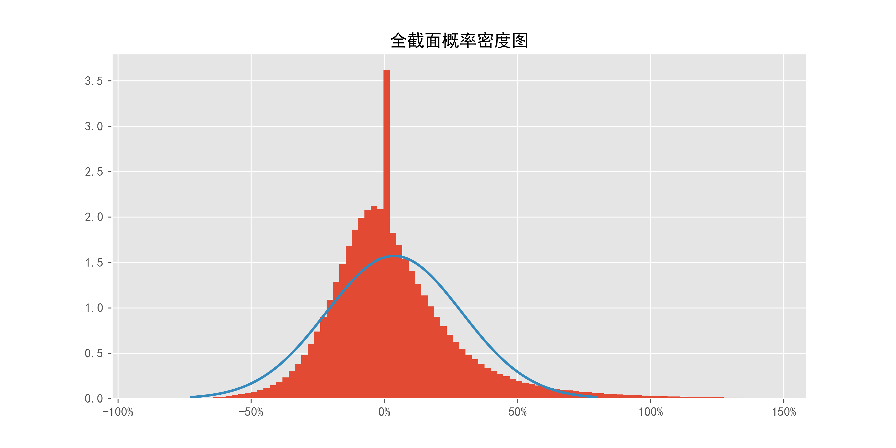
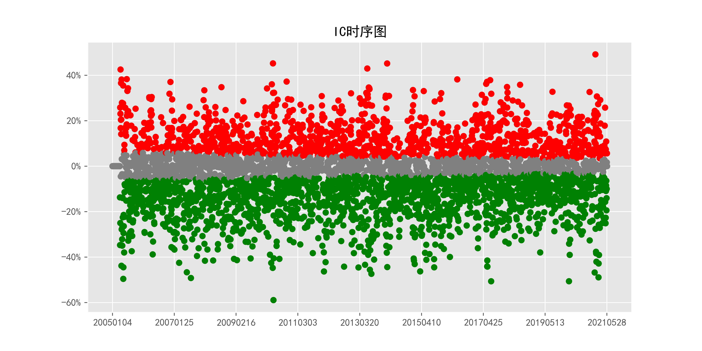
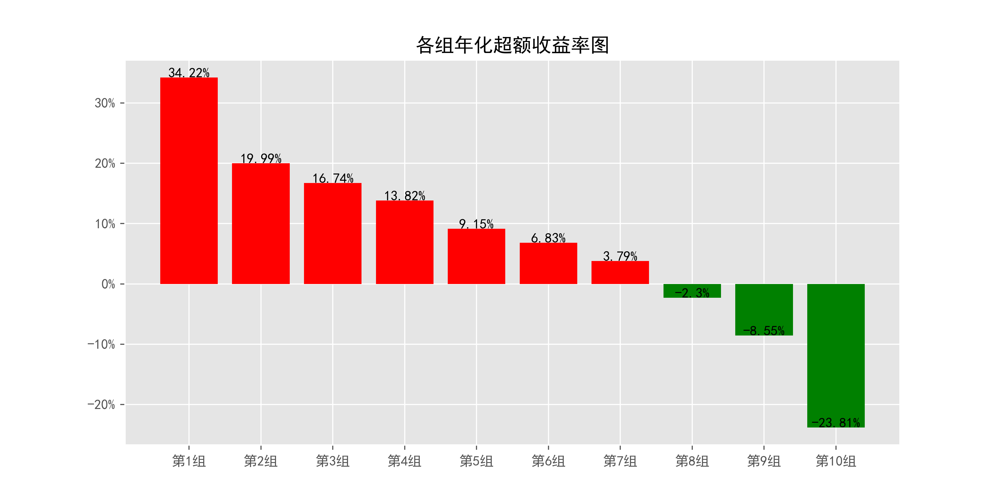
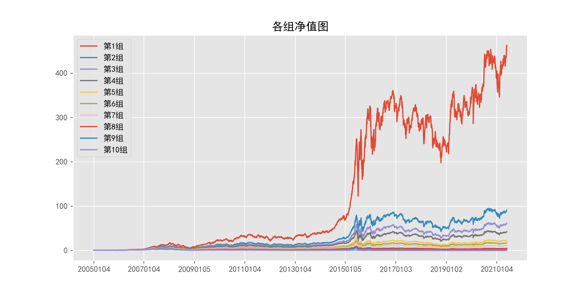
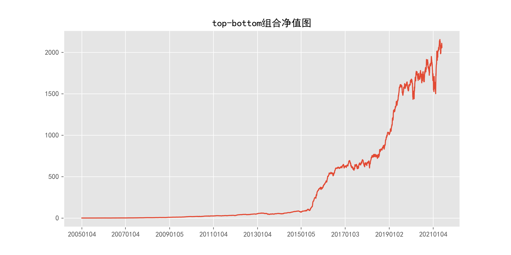
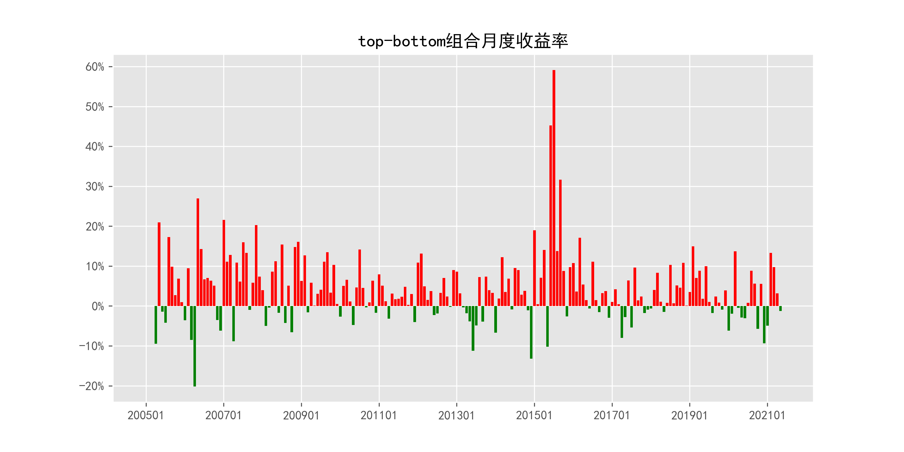
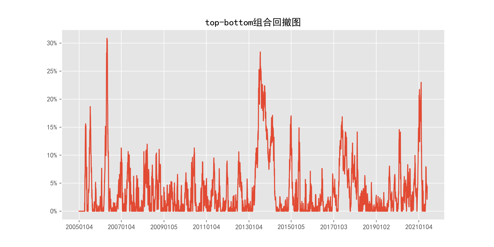

# ReturnMomentum_daily_60Days

## 1_基本情况

### 1.1_概率密度图

### 1.2_描述性统计

|因子换手率|样本数|均值|众数|标准差|偏度|峰度|
|:-:|:-:|:-:|:-:|:-:|:-:|:-:|
|5.58%|9786760|0.0435|0.0000|28.45%|3.55|75.76|

|最小值|P05|P25|中位数|P75|P95|最大值|
|:-:|:-:|:-:|:-:|:-:|:-:|:-:|
|-0.9040|-0.2945|-0.1149|0.0000|0.1430|0.5261|28.9183|

## 2_ICIR法检验结果

### 2.1_IC时序图

### 2.2_ICIR法检验数据

|IC均值|IR值|显著比例|正显著比例|负显著比例|同向显著比例|反转显著比例|
|:-:|:-:|:-:|:-:|:-:|:-:|:-:|
|-3.26%|-22.73%|73.26%|27.52%|45.74%|44.76%|55.24%|

## 3_分组法检验结果

### 3.1_各组年化超额收益率图

### 3.2_各组净值图

### 3.3_Top-Bottom组合净值图

### 3.4_Top-Bottom组合月收益率图

### 3.5_Top-Bottom组合回撤图

### 3.6_分组法检验数据

|组别|组合年化|超额年化|夏普比率|信息比率|最大回撤|仓位换手率|
|:-:|:-:|:-:|:-:|:-:|:-:|:-:|
|TMB|61.38%|48.65%|2.87|1.23|30.86%|0.00%|
|1|46.95%|34.22%|1.22|2.40|70.85%|17.33%|
|2|32.72%|19.99%|0.90|1.76|69.44%|37.91%|
|3|29.46%|16.74%|0.82|1.64|69.42%|46.93%|
|4|26.55%|13.82%|0.74|1.45|68.99%|51.01%|
|5|21.88%|9.15%|0.61|1.02|69.70%|52.30%|
|6|19.55%|6.83%|0.55|0.81|71.62%|51.27%|
|7|16.52%|3.79%|0.46|0.45|73.50%|48.03%|
|8|10.43%|-2.30%|0.29|-0.26|76.18%|42.06%|
|9|4.18%|-8.55%|0.11|-0.88|79.24%|31.83%|
|10|-11.08%|-23.81%|-0.29|-1.65|95.89%|14.22%|

|组别|日均收益率|日胜率|日盈亏比|月均收益率|月胜率|月盈亏比|
|:-:|:-:|:-:|:-:|:-:|:-:|:-:|
|TMB|0.20%|54.82%|1.21|4.29%|69.04%|1.99|
|1|0.18%|56.75%|0.92|3.86%|60.41%|1.53|
|2|0.14%|56.27%|0.90|2.90%|58.38%|1.40|
|3|0.13%|56.40%|0.88|2.67%|57.87%|1.38|
|4|0.12%|56.27%|0.88|2.45%|59.39%|1.25|
|5|0.10%|56.27%|0.86|2.13%|56.35%|1.32|
|6|0.10%|56.00%|0.86|1.96%|58.38%|1.17|
|7|0.09%|55.34%|0.87|1.75%|56.35%|1.21|
|8|0.07%|55.02%|0.86|1.31%|55.84%|1.10|
|9|0.04%|54.32%|0.86|0.83%|52.28%|1.11|
|10|-0.02%|52.13%|0.87|-0.36%|47.21%|0.99|
