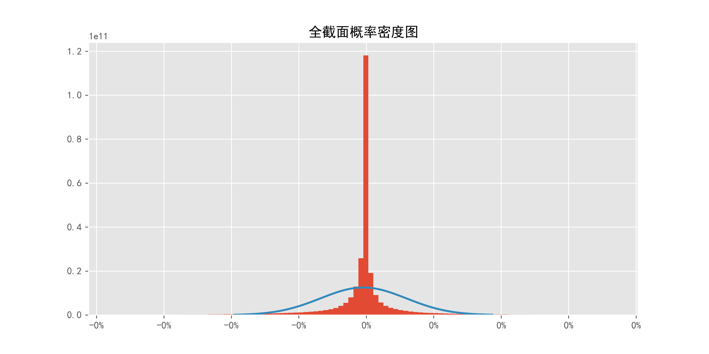
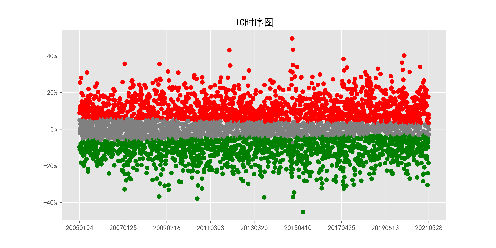
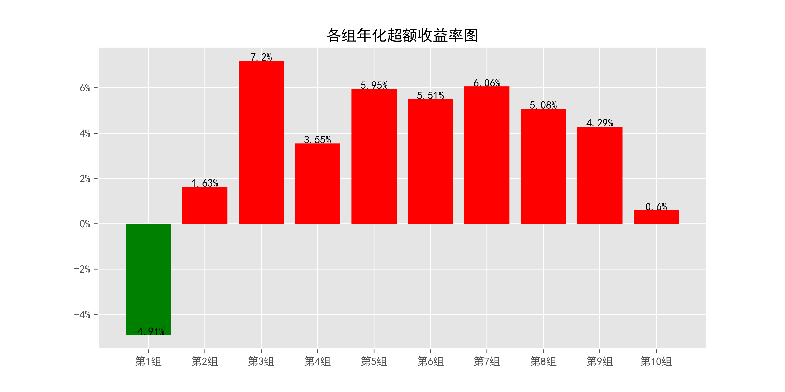
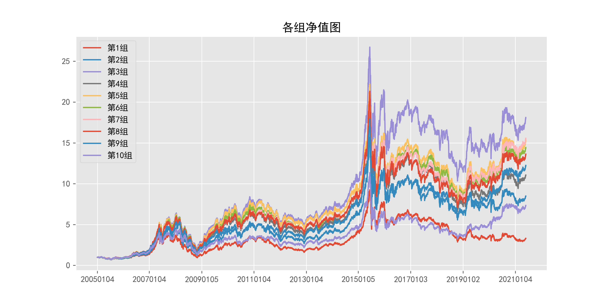
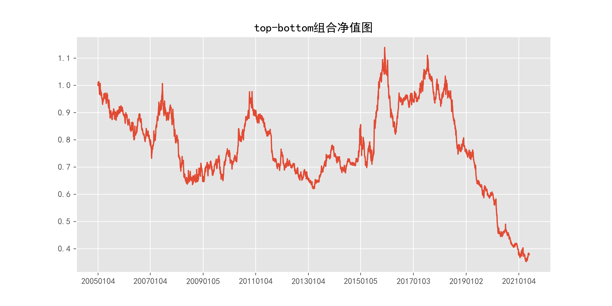
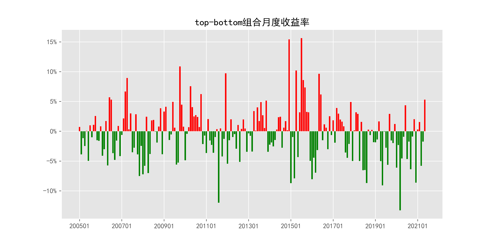
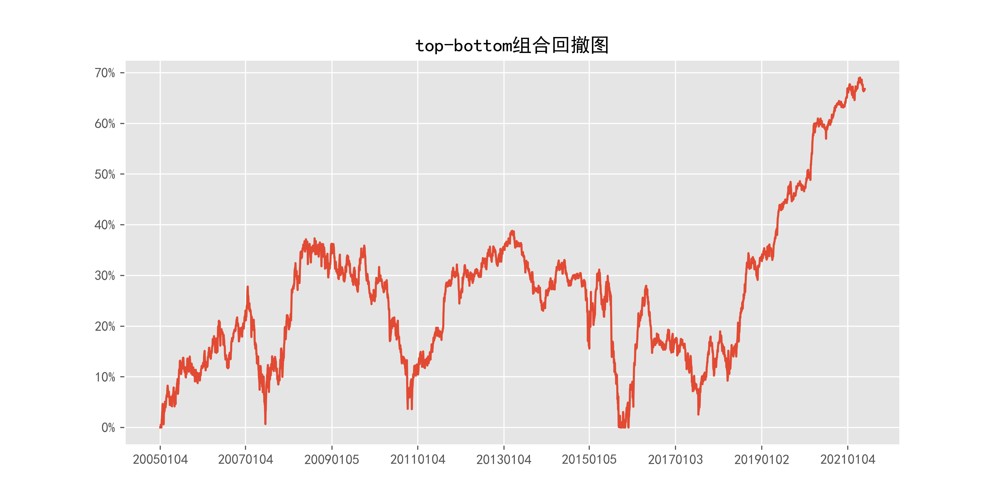

# iDReturn_FF_quotely_5min

## 1_基本情况

### 1.1_概率密度图

### 1.2_描述性统计

|因子换手率|样本数|均值|众数|标准差|偏度|峰度|
|:-:|:-:|:-:|:-:|:-:|:-:|:-:|
|95.75%|9249716|-0.0000|0.0000|0.00%|-0.20|129.63|

|最小值|P05|P25|中位数|P75|P95|最大值|
|:-:|:-:|:-:|:-:|:-:|:-:|:-:|
|-0.0000|-0.0000|-0.0000|-0.0000|0.0000|0.0000|0.0000|

## 2_ICIR法检验结果

### 2.1_IC时序图

### 2.2_ICIR法检验数据

|IC均值|IR值|显著比例|正显著比例|负显著比例|同向显著比例|反转显著比例|
|:-:|:-:|:-:|:-:|:-:|:-:|:-:|
|0.27%|2.35%|67.91%|34.85%|33.07%|34.65%|65.35%|

## 3_分组法检验结果

### 3.1_各组年化超额收益率图

### 3.2_各组净值图

### 3.3_Top-Bottom组合净值图

### 3.4_Top-Bottom组合月收益率图

### 3.5_Top-Bottom组合回撤图

### 3.6_分组法检验数据

|组别|组合年化|超额年化|夏普比率|信息比率|最大回撤|仓位换手率|
|:-:|:-:|:-:|:-:|:-:|:-:|:-:|
|TMB|-5.91%|-18.64%|-0.39|-0.51|69.05%|0.00%|
|1|7.82%|-4.91%|0.22|-0.46|74.73%|86.68%|
|2|14.36%|1.63%|0.40|0.18|72.58%|89.97%|
|3|19.92%|7.20%|0.55|0.88|69.86%|89.93%|
|4|16.28%|3.55%|0.45|0.44|71.44%|89.69%|
|5|18.68%|5.95%|0.51|0.74|71.54%|89.49%|
|6|18.23%|5.51%|0.50|0.69|71.88%|89.47%|
|7|18.79%|6.06%|0.52|0.74|71.36%|89.64%|
|8|17.81%|5.08%|0.49|0.61|71.76%|89.98%|
|9|17.02%|4.29%|0.47|0.48|71.71%|89.92%|
|10|13.32%|0.60%|0.37|0.06|71.38%|87.17%|

|组别|日均收益率|日胜率|日盈亏比|月均收益率|月胜率|月盈亏比|
|:-:|:-:|:-:|:-:|:-:|:-:|:-:|
|TMB|-0.02%|47.84%|1.03|-0.40%|47.21%|0.88|
|1|0.06%|54.59%|0.89|1.16%|52.28%|1.22|
|2|0.08%|55.64%|0.88|1.62%|54.82%|1.25|
|3|0.10%|55.97%|0.89|2.01%|54.82%|1.38|
|4|0.09%|56.00%|0.88|1.76%|54.82%|1.30|
|5|0.10%|56.57%|0.87|1.92%|55.84%|1.31|
|6|0.09%|56.35%|0.87|1.89%|54.82%|1.35|
|7|0.10%|56.75%|0.86|1.92%|58.88%|1.16|
|8|0.09%|56.77%|0.86|1.85%|57.87%|1.19|
|9|0.09%|56.00%|0.88|1.80%|60.91%|1.04|
|10|0.08%|55.52%|0.88|1.51%|58.88%|1.05|
